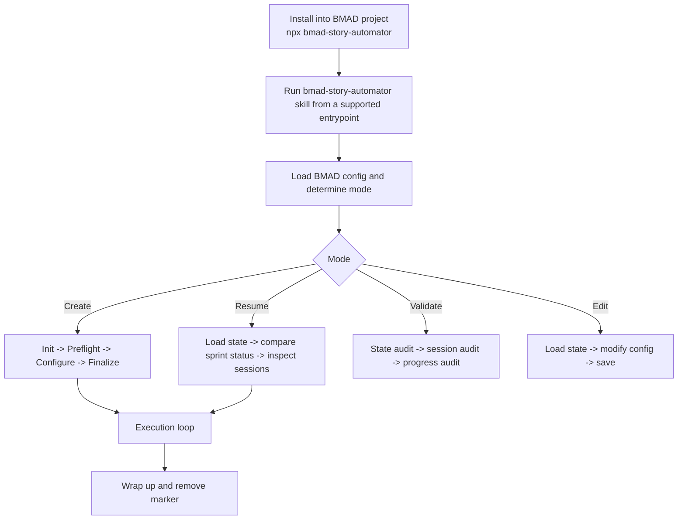
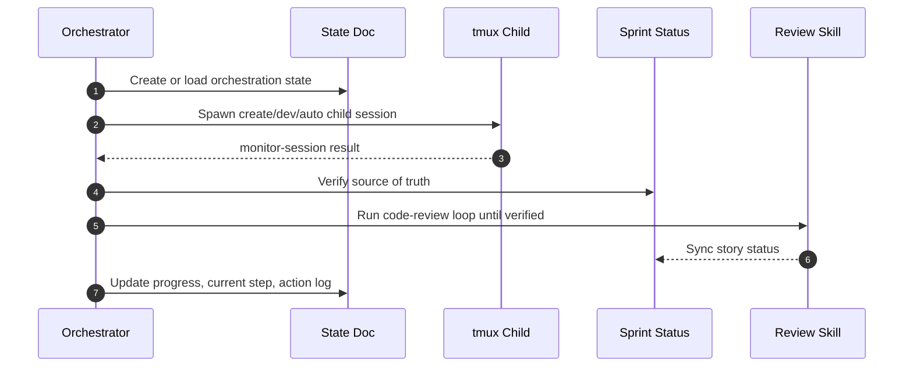

# bmad-story-automator

Portable BMAD story-automator skill bundle — a Python port of `bma-d/bmad-story-automator-go`. Distributed as both a Claude Code plugin and an npm package.

**Version:** 1.15.0
**Status:** Active development on `bma-d/sw-port-foundation` (M01 — Event types, typed-telemetry substrate)
**Python:** 3.11, 3.12, 3.13 (CI); 3.14 required by spec REQ-01

## Overview

`bmad-story-automator` orchestrates BMAD story workflows through a tmux-driven runtime with structured telemetry. The Python port retains the surface area of the Go implementation while running on a stdlib-first dependency budget (`stdlib + filelock + psutil`).

Packaging is hybrid:

- **npm package** — `bin/bmad-story-automator` is a Node shim that wraps `install.sh` and refuses `process.platform === 'win32'`.
- **Claude Code plugin** — the `skills/bmad-story-automator/` tree installs into `.claude/skills` as a pure skill bundle.
- **Python distribution** — `hatchling`-built wheel of the `story_automator` package.

The active milestone (M01) defines the event-type substrate for typed telemetry. Subsequent milestones (M02–M10) layer the emitter, cost-capture path, HMAC chaining, and failure-classification consumers.

## Quickstart

### Install (npm)

```bash
npm install -g bmad-story-automator
bmad-story-automator --help
```

The Node shim invokes `install.sh`, which provisions the Python `story_automator` package. Windows is not supported by the shim — use WSL Ubuntu-26.04 for runtime verification gates.

### Install (Claude Code plugin)

Drop the contents of `skills/bmad-story-automator/` into `.claude/skills/bmad-story-automator/`. The skill markdown lives under `steps-c/`, `steps-e/`, and `steps-v/`.

### Run the test suite

```bash
npm run test:python          # full Python suite (unittest discover)
npm run test:smoke           # smoke tests
npm run verify               # full verify pipeline
npm run pack:dry-run         # npm pack dry run
```

`pytest -q` is also supported — `pytest` discovers `unittest.TestCase` natively.

```text
Use the bmad-story-automator skill.
```

Manual skill copy (replace `.claude` with `.agents` or `.codex` to match your runtime; the helper must stay executable):

```bash
SKILLS=.claude/skills   # or .agents/skills, or .codex/skills
cp -a skills/bmad-story-automator /absolute/path/to/project/$SKILLS/
cp -a skills/bmad-story-automator-review /absolute/path/to/project/$SKILLS/
chmod +x /absolute/path/to/project/$SKILLS/bmad-story-automator/scripts/story-automator
```

### Use From A Local Clone

To use your own clone (e.g. a fork) instead of the published npm package, run the bundled installer directly from the clone against your BMAD project:

```bash
git clone https://github.com/<you>/bmad-automator
cd bmad-automator
./install.sh /absolute/path/to/your-bmad-project    # or: node bin/bmad-story-automator /absolute/path/to/your-bmad-project
```

The installer preflights host tools (`bash`, `python3`, `jq`; warns on missing `tmux`) and requires the BMAD dependency skills (`bmad-create-story`, `bmad-dev-story`, `bmad-retrospective`) to already be installed in the project. Install BMAD-Method into the project first if they are missing.

### Starting The Orchestrator

The orchestrator is not a standalone process — it is a skill you invoke **inside a Claude Code (or Codex) session opened in the BMAD project root**. After installing, start a session there and say:

```text
Use the bmad-story-automator skill.
```

It then drives the deterministic helper CLI and spawns per-story `claude`/`codex` child sessions in tmux. **Skip Automate** is a preflight option: set it to `true` to skip the optional automated QA step (`bmad-qa-generate-e2e-tests`) when that skill is not installed.

## BMAD Method Install Channels
### Lint, format, coverage

```bash
python -m ruff check <paths>
python -m ruff format --check <paths>
python -m coverage run --source=<src> -m unittest tests.<file>
python -m coverage report -m --fail-under=85
```

## Architecture

```
.
├── skills/bmad-story-automator/
│   ├── pyproject.toml                  # name=story-automator, py >=3.11
│   ├── src/story_automator/
│   │   ├── __init__.py                 # __version__ = "1.15.0"
│   │   ├── __main__.py
│   │   ├── cli.py                      # CLI entry point
│   │   ├── adapters/                   # external adapters
│   │   ├── commands/                   # orchestrator, retro, state, tmux, ...
│   │   └── core/                       # shared helpers (namespace by convention)
│   │       ├── common.py               # iso_now, compact_json, write_atomic, run_cmd
│   │       ├── agent_config.py         # @dataclass conventions reference
│   │       ├── tmux_runtime.py         # tmux session orchestration
│   │       └── runtime_*.py
│   ├── steps-c/, steps-e/, steps-v/    # skill markdown
│   └── data/                           # prompts and templates
├── tests/                              # ~13 unittest files
├── docs/
│   ├── superpowers/
│   │   ├── specs/                      # sw-lint-passing specs + design docs
│   │   └── plans/                      # implementation plans
│   └── changelog/<YYMMDD>.md
├── bin/bmad-story-automator            # Node shim (refuses Windows)
├── install.sh                          # bash installer
└── package.json                        # npm scripts
```

### Key modules

- **`core/common.py`** — canonical helpers (`iso_now`, `compact_json`, `write_atomic`, `ensure_dir`, `run_cmd`). Import from here; do not duplicate.
- **`core/tmux_runtime.py`** — tmux session lifecycle. Runtime verification requires WSL Ubuntu-26.04 (M02 / M05 / M06 / M07 / M10).
- **`commands/`** — orchestrator, retro, state, tmux command surfaces.
- **`adapters/`** — external integrations.

### Milestone scope

| Milestone | Scope |
|---|---|
| **M01** | Event types — data definitions + parsing protocol (current) |
| M02 | `TelemetryEmitter` + `TelemetryReader`; wire existing log sites |
| M03 | Cost-capture path |
| M04 | HMAC chaining |
| M07 | Failure-classification consumers |

Recent work on M01 has landed the 13 concrete event classes (REQ-05 + REQ-06) — see commits `dfc2c22` through `7ae1072`.

## Contributing

### Conventions

- **Python source:** `from __future__ import annotations` at the top. Plain `@dataclass` (not `frozen`, not `slots`). PEP 604 unions (`str | None`, not `Optional[str]`). Imports grouped stdlib → third-party → local.
- **Naming:** snake_case for Python attributes and JSON keys.
- **Tests:** `unittest.TestCase` subclasses. Mixed `assert` and `self.assertEqual` is acceptable. No subprocess invocations, no tmux dependency in unit tests, cross-platform safe.
- **File size:** target under ~500 LOC per file.
- **Commits:** [Conventional Commits](https://www.conventionalcommits.org/) (`feat(scope):`, `fix(scope):`, `test(scope):`, `refactor(scope):`, `docs(scope):`, `style(scope):`, `build(scope):`). One commit per task step. Add a `Generated-By` trailer.

### Hard guardrails

- **Dependency allowlist:** stdlib + `filelock` + `psutil`. Adding anything else requires operator approval (spec REQ-11 is grep-enforceable).
- **No subprocess, network, or tmux** in unit tests.
- **No modifications** to `bin/bmad-story-automator`, `install.sh`, or the `pyproject.toml` allowlist without flagging it as a behavioral change.
- **No speculative planning docs.** Specs and plans live only under `docs/superpowers/specs/` and `docs/superpowers/plans/`.
- **No `--no-verify`.** If a pre-commit hook fails, fix the root cause.
- **No force-push** to `main` or to a branch with an open upstream PR.
- **Preserve pure skill-install behavior** under `.claude/skills`; legacy `_bmad/bmm` paths are migration-only.

### Cross-platform requirement

Tests must pass on Windows git-bash, WSL Ubuntu, and Linux CI without modification. Runtime verification gates (M02 / M05 / M06 / M07 / M10) require WSL Ubuntu-26.04 because of tmux. M01 is pure data and runs on any platform.

### Specs and plans

- M01 spec: `docs/superpowers/specs/2026-06-14-m01-event-types.md`
- M01 design: `docs/superpowers/specs/2026-06-14-m01-event-types-design.md`
- M01 plan: `docs/superpowers/plans/2026-06-14-m01-event-types.md`
- Hybrid Node + Python decision: `DISCOVERY.md`

### Pull requests





Practical shape:

- create, resume, validate, and edit are first-class modes
- preflight complexity scoring happens before agent selection
- `done` is gated by review verification
- retrospectives fire inside the execution loop, per epic, not only at the very end

## Docs Map

- [How It Works](./docs/how-it-works.md)
- [Story Execution](./docs/story-execution.md)
- [State And Resume](./docs/state-and-resume.md)
- [Agents And Monitoring](./docs/agents-and-monitoring.md)
- [Installation And Layout](./docs/installation-and-layout.md)
- [Review Workflow](./docs/review-workflow.md)
- [CLI Reference](./docs/cli-reference.md)
- [Troubleshooting](./docs/troubleshooting.md)
- [Development](./docs/development.md)

## Requirements

Host requirements (all must be on `PATH`):

- `python3` 3.11+ — the helper runtime
- `bash` and `jq` — the orchestration steps build commands and parse the helper's JSON with `jq`; a missing `jq` makes those steps fail silently
- `tmux` — child agent sessions run in detached tmux panes
- `git` — used by `commit-ready` / `commit-story`
- a child agent CLI on `PATH`: `claude` (Claude Code) and/or `codex`
- `node` 18+ — only for the `npx` / `bin/bmad-story-automator` install path
- Linux or macOS. Windows is supported **only via WSL** — the npm launcher refuses native Windows, and `tmux` is POSIX-only.

Target project requirements:

- `_bmad/` project directory
- BMAD dependency skill entrypoints under at least one supported skill root (`.agents/skills`, `.claude/skills`, and/or `.codex/skills`):
  - `bmad-create-story`
  - `bmad-dev-story`
  - `bmad-retrospective`
  - optional `bmad-qa-generate-e2e-tests`

Claude-only, Codex-only, and mixed projects are all supported. The installer updates each supported root that already contains the required dependency `SKILL.md` files.

Dependency skill internals such as `workflow.md` are optional. If the QA skill is missing, install still succeeds. Run Story Automator with `Skip Automate = true` unless the QA skill is installed.

## Install Verification

Inside a target project, verify the installed package layout:

```bash
cd /path/to/project
found=0
for skills_root in .agents/skills .claude/skills .codex/skills; do
  if test -f "$skills_root/bmad-story-automator/SKILL.md"; then
    found=1
    test -f "$skills_root/bmad-story-automator-review/SKILL.md"
    test -x "$skills_root/bmad-story-automator/scripts/story-automator"
  fi
done
test "$found" -eq 1
```

Expected:

- helper CLI prints usage
- the main skill exists
- the bundled review gate exists
- the skill is installed under each complete supported dependency skill root

## Development Verification

```bash
npm run verify
PYTHONPATH=skills/bmad-story-automator/src python3 -m story_automator --help
```

More: [Development](./docs/development.md)

## Publish To npm

Publish steps:

- `npm adduser`
- `npm publish`

More: [Development](./docs/development.md#release)

For BMAD Method stable tags, preview tags, registry `next`, and npm dist-tags,
see [Versioning And Release Channels](./docs/versioning.md).
Open PRs against `main`. Each milestone is tightly scoped — do not pull work forward from later milestones. Run `npm run verify` locally before requesting review.
