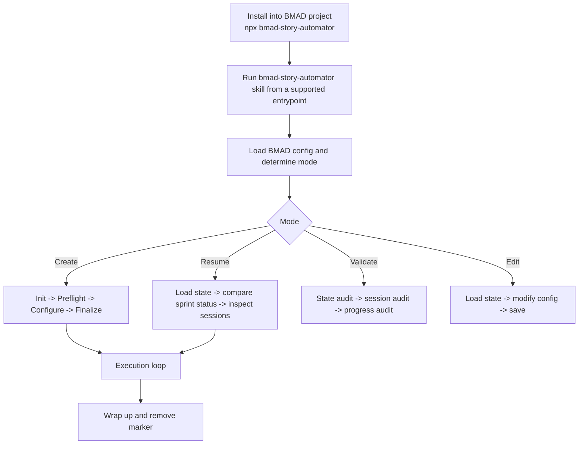
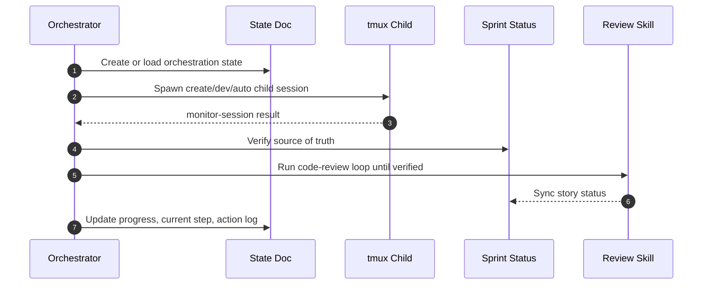

# bmad-story-automator

Portable BMAD `bmad-story-automator` skill/plugin bundle plus a Python
port of `bma-d/bmad-story-automator-go`. Ships as an npm package, a
Claude Code plugin, and a local marketplace catalog entry, with a
production-grade evidence-collecting gate subsystem written in Python
(stdlib + `filelock` + `psutil` only).

The repository contains:

- `skills/bmad-story-automator/` — installable skill carrying the
  Python runtime (`src/story_automator/...`), the gate subsystem,
  collectors, verifiers, and CLI commands.
- `skills/bmad-story-automator-review/` — bundled adversarial
  code-review skill.
- `bin/bmad-story-automator`, `install.sh`, `.claude-plugin/` — npm
  bin entrypoint, installer, and plugin / marketplace manifests.
- `docs/` — operator-facing docs, milestone specs / plans, dated
  changelog entries under `docs/changelog/`, and audit status reports
  under `docs/audit/`.

## What shipped this session (2026-06-23 + 2026-06-24)

This session closed out the cost / lineage / drift observability arc
plus the operability + bug-sweep cleanup that preceded it. Highlights:

- **C1 / C2 / C3** — the cross-genre observability triple landed:
  `SpecDriftWatcher` (`core/innovation/spec_drift_watcher.py`) with
  optional disk-backed baselines via
  `core/innovation/spec_drift_persistence.py`; cross-genre artifact
  lineage ledger (`core/innovation/lineage_ledger.py`) with disk
  persistence + a `lineage` top-level query CLI; per-collector cost
  evidence (`core/innovation/cost_evidence.py`) with automatic
  session-usage capture
  (`core/innovation/session_usage_capture.py`).
- **N7 unblocker** — usage parsers under
  `core/usage_parsers/{claude_jsonl,codex_rollout,gemini_chat,none}.py`
  plus the `core/innovation/cost_attribution.py` substrate.
- **L1 / L2 / L1-followup** — gate-marker concurrency hardened via
  filelock + targeted quarantine + PID liveness; lock now also
  protects `system_gate.run_system_gate`.
- **Round-1 / Round-2 / Round-3 bug sweeps** — multi-lens adversarial
  sweeps; deferred-batch follow-ups landed (A-follow, M-3
  fsync-parent-dir for atomic rename durability, L-docstring gaps).
- **D-04 + D-04 follow-up** — `BMAD_AUDIT_KEY` scrubbed from
  subprocess env at the trust boundary; helper extracted into
  `core/audit_env_scrub.py` (rename-proof AST invariant).
- **K-2 + K-5** — evidence-bundle memoization with explicit
  invalidation; quarantine-under-lock + rmtree-outside-lock with
  startup janitor.
- **G7 (D-implement)** — sprint-phase dual-store unification
  (`core/integration/unified_state.py`) with reversed read/write
  order and self-cancellation guard.
- **Path B compat** — N4 (`profile_composer`), N5 (Merkle export),
  N6.3 (HookBus orchestrator wiring), N6.4 (declarative plugin
  registry), N6.5 (CLI dispatcher), N6.6 (Action enum), N7.1
  (feature-flagged tmux→dispatcher migration).
- **Operability batch (B)** — `psutil.create_time()` bound on legacy
  markers, `GateLockTimeoutError` carrying holder PID + started_at +
  hostname, opt-in `.githooks/pre-commit`.

Tests: 4070 at session start → 4823 passing at HEAD (the session
closed at 4348; C5 + G2 + post-session bug-fix rounds landed afterward
and added ~475 more tests).
Ruff clean. Audit-floor invariants: 11 invariant classes / 45 test
methods at HEAD (G7 added the `UnifiedStateWriteIsolationInvariant`
class with two test methods; C5 + G2 subsequently added three more
invariant classes — `ThresholdApplyIsolationInvariant`,
`ThresholdLockIsolationInvariant`, `WorktreePerUnitIsolationInvariant`).
Zero new Python dependencies. No edits to `core/telemetry_events.py`.
See `CHANGELOG.md` and the per-workflow status reports under
`docs/audit/` for the dated trail.

## Quick start (Python gate API)

The production-ready gate is invoked via
`core.gate_orchestrator.run_production_gate`. The signature stays
purely additive — all the new this-session kwargs default to `None`
or off, so existing callers keep their byte-identical behavior:

```python
from story_automator.core.gate_orchestrator import run_production_gate

result = run_production_gate(
    project_root,
    gate_id,
    commit_sha=commit_sha,
    target={"kind": "story", "id": story_key},
    profile=profile,                  # core.product_profile.load_effective_profile(...)
    factory_version=factory_version,  # core.gate_orchestrator.resolve_factory_version()
    registry=registry,                # core.collector_registry.CollectorRegistry
    # --- session-2026-06-23 additive kwargs (all OPTIONAL, default off) ---
    enable_lie_detector=False,        # phase-1 baseline-commit drift check
    baseline_sha=None,                # str — for the lie-detector
    fail_closed=False,                # phase-2 error-status forces FAIL
    enable_pre_gate_verifier=False,   # phase-3 inline checks
    result_json_path=None,            # phase-2 schema-pinned result.json output
    drift_watcher=None,               # core.innovation.spec_drift_watcher.SpecDriftWatcher
    session_usage=None,               # core.innovation.cost_attribution.UsageMetrics
    threshold_proposer=None,          # core.innovation.threshold_proposer.ThresholdProposer (C5)
    isolation_mode="shared",          # G2 — "shared" (default) or "per_unit" worktree-per-unit isolation
    max_workers=4,                    # G2 — bounded parallelism for per_unit mode (RAM-aware clamp)
)
```

When `session_usage` is supplied, per-collector cost files land under
`_bmad/gate/cost/<gate_id>/` and the resulting gate file carries an
additional `cost_total_usd` field. When `drift_watcher` is supplied,
the watcher is polled twice (pre-collect, post-evaluate) and a
`SpecDriftEvent` is recorded if drift is detected.

For symmetry, `core.system_gate.run_system_gate` accepts the same
`session_usage` kwarg and emits the same `cost_total_usd` field.

## Operator CLI

The `lineage` command is wired at top level for read-only inspection
of the persisted lineage ledger under `_bmad/lineage/`:

```
PYTHONPATH=skills/bmad-story-automator/src \
  python3 -m story_automator lineage --help
```

Subcommands: `show`, `entry`, `stats`, `verify`, `orphans`. All
read-only; output is canonical JSON with alphabetically-sorted keys
for byte-deterministic diffs across machines.

The `calibration` command (C5 self-improving gate) exposes five
subcommands — `propose`, `list-proposals`, `show`, `apply`, `reject` —
for advisory threshold-tuning. The `apply` subcommand requires an
8-hex confirm slug and is the only path that mutates source. Bare
`calibration` invocation prints the M08 success-rate table
(byte-identical golden fixture).

The `gate` subtree (status, resume, invalidate, readiness) is
unchanged from prior releases.

## Frozen public surface (contract source)

The authoritative "what not to break" list for the gate subsystem
lives at [docs/spec/frozen-gate-surface.md](docs/spec/frozen-gate-surface.md).
Every adoption PR must keep that surface byte-stable (extensions /
new OPTIONAL kwargs are permitted, renames / removals / signature
narrowings are not). The five frozen behaviors (four audit fixes plus
the Path B plugin trust-boundary) are pinned by
`tests/test_audit_regression.py` — keep that suite green.

## Install Into A BMAD Project

Install the skill bundle into your BMAD project from npm:

```bash
npx bmad-story-automator /absolute/path/to/your-bmad-project
```

Then run the installed skill from your supported entrypoint session:

```text
Use the bmad-story-automator skill.
```

Manual skill copy (replace `.claude` with `.agents` or `.codex` to match your runtime; the helper must stay executable):

```bash
SKILLS=.claude/skills   # or .agents/skills, or .codex/skills
cp -a skills/bmad-story-automator /absolute/path/to/project/$SKILLS/
cp -a skills/bmad-story-automator-review /absolute/path/to/project/$SKILLS/
chmod +x /absolute/path/to/project/$SKILLS/bmad-story-automator/scripts/story-automator
```

### Use From A Local Clone

To use your own clone (e.g. a fork) instead of the published npm package, run the bundled installer directly from the clone against your BMAD project:

```bash
git clone https://github.com/<you>/bmad-automator
cd bmad-automator
./install.sh /absolute/path/to/your-bmad-project    # or: node bin/bmad-story-automator /absolute/path/to/your-bmad-project
```

The installer preflights host tools (`bash`, `python3`, `jq`; warns on missing `tmux`) and requires the BMAD dependency skills (`bmad-create-story`, `bmad-dev-story`, `bmad-retrospective`) to already be installed in the project. Install BMAD-Method into the project first if they are missing.

### Starting The Orchestrator

The orchestrator is not a standalone process — it is a skill you invoke **inside a Claude Code (or Codex) session opened in the BMAD project root**. After installing, start a session there and say:

```text
Use the bmad-story-automator skill.
```

It then drives the deterministic helper CLI and spawns per-story `claude`/`codex` child sessions in tmux. **Skip Automate** is a preflight option: set it to `true` to skip the optional automated QA step (`bmad-qa-generate-e2e-tests`) when that skill is not installed.

## BMAD Method Install Channels

If you install Automator through the BMAD Method official module code `automator`, choose the channel explicitly.
Run these from the target BMAD project root, or add `--directory /absolute/path/to/your-bmad-project`.

Stable install, using the latest pure-semver tag:

```bash
npx bmad-method install --modules automator --all-stable --tools claude-code --yes
```

Stable pin to the first Codex-capable stable tag:

```bash
npx bmad-method install --modules automator --pin automator=v1.15.0 --tools codex --yes
```

Rollback to the pre-Codex stable tag if needed:

```bash
npx bmad-method install --modules automator --pin automator=v1.14.2 --tools claude-code --yes
```

Codex preview branch, only for testing unpublished follow-up fixes:

```bash
npx bmad-method install --custom-source https://github.com/bmad-code-org/bmad-automator@next/codex-runtime-support --tools codex --yes
```

Current caveat: the official registry sets `automator` to `default_channel: next`, so unqualified `--modules automator` and `--next automator` resolve to `main` HEAD. After this stable release lands on `main`, those commands include Codex support, but use `--all-stable` or `--pin` when you need reproducible stable behavior. For custom-source branch testing, verify the custom-source cache HEAD and installed runtime files instead of trusting installer exit status, summary text, or manifest channel fields alone.

## Expectations

- This is an orchestrator, not a correctness guarantee. Bad planning artifacts still produce bad implementation runs.
- The npm installer writes the skill into every supported dependency skill root that is complete: `.agents/skills`, `.claude/skills`, and/or `.codex/skills`.
- Child sessions can use Claude or Codex depending on agent configuration.
- Retrospectives inherit the configured primary agent by default, and can be overridden explicitly via `agentConfig`.
- The automator expects sprint planning to be complete before it starts.
- Review completion is gated by verification, not by child-session exit alone.
- If the optional QA automate skill is missing, install still succeeds, but runs should use `Skip Automate = true`.

## What This Is

Story Automator automates the BMAD implementation loop for one or more stories:

1. create story
2. implement story
3. optionally run automate/test generation
4. run adversarial code review with retries
5. commit verified work
6. trigger retrospective when an epic is fully complete

The core runtime model is:

- one orchestrator session
- one markdown state document
- many short-lived tmux child sessions
- one marker file guarding against accidental stop
- `sprint-status.yaml` plus story files as the source of workflow truth

## How It Works





Practical shape:

- create, resume, validate, and edit are first-class modes
- preflight complexity scoring happens before agent selection
- `done` is gated by review verification
- retrospectives fire inside the execution loop, per epic, not only at the very end

## Docs Map

- [How It Works](./docs/how-it-works.md)
- [Story Execution](./docs/story-execution.md)
- [State And Resume](./docs/state-and-resume.md)
- [Agents And Monitoring](./docs/agents-and-monitoring.md)
- [Installation And Layout](./docs/installation-and-layout.md)
- [Review Workflow](./docs/review-workflow.md)
- [CLI Reference](./docs/cli-reference.md)
- [Troubleshooting](./docs/troubleshooting.md)
- [Development](./docs/development.md)

## Requirements

Host requirements (all must be on `PATH`):

- `python3` 3.11+ — the helper runtime
- `bash` and `jq` — the orchestration steps build commands and parse the helper's JSON with `jq`; a missing `jq` makes those steps fail silently
- `tmux` — child agent sessions run in detached tmux panes
- `git` — used by `commit-ready` / `commit-story`
- a child agent CLI on `PATH`: `claude` (Claude Code) and/or `codex`
- `node` 18+ — only for the `npx` / `bin/bmad-story-automator` install path
- Linux or macOS. Windows is supported **only via WSL** — the npm launcher refuses native Windows, and `tmux` is POSIX-only.

Target project requirements:

- `_bmad/` project directory
- BMAD dependency skill entrypoints under at least one supported skill root (`.agents/skills`, `.claude/skills`, and/or `.codex/skills`):
  - `bmad-create-story`
  - `bmad-dev-story`
  - `bmad-retrospective`
  - optional `bmad-qa-generate-e2e-tests`

Claude-only, Codex-only, and mixed projects are all supported. The installer updates each supported root that already contains the required dependency `SKILL.md` files.

Dependency skill internals such as `workflow.md` are optional. If the QA skill is missing, install still succeeds. Run Story Automator with `Skip Automate = true` unless the QA skill is installed.

## Install Verification

Inside a target project, verify the installed package layout:

```bash
cd /path/to/project
found=0
for skills_root in .agents/skills .claude/skills .codex/skills; do
  if test -f "$skills_root/bmad-story-automator/SKILL.md"; then
    found=1
    test -f "$skills_root/bmad-story-automator-review/SKILL.md"
    test -x "$skills_root/bmad-story-automator/scripts/story-automator"
  fi
done
test "$found" -eq 1
```

Expected:

- helper CLI prints usage
- the main skill exists
- the bundled review gate exists
- the skill is installed under each complete supported dependency skill root

## Development Verification

```bash
npm run verify
PYTHONPATH=skills/bmad-story-automator/src python3 -m story_automator --help
```

More: [Development](./docs/development.md)

## Publish To npm

Publish steps:

- `npm adduser`
- `npm publish`

More: [Development](./docs/development.md#release)

For BMAD Method stable tags, preview tags, registry `next`, and npm dist-tags,
see [Versioning And Release Channels](./docs/versioning.md).

## License

See [LICENSE](LICENSE) and [SECURITY.md](SECURITY.md).
