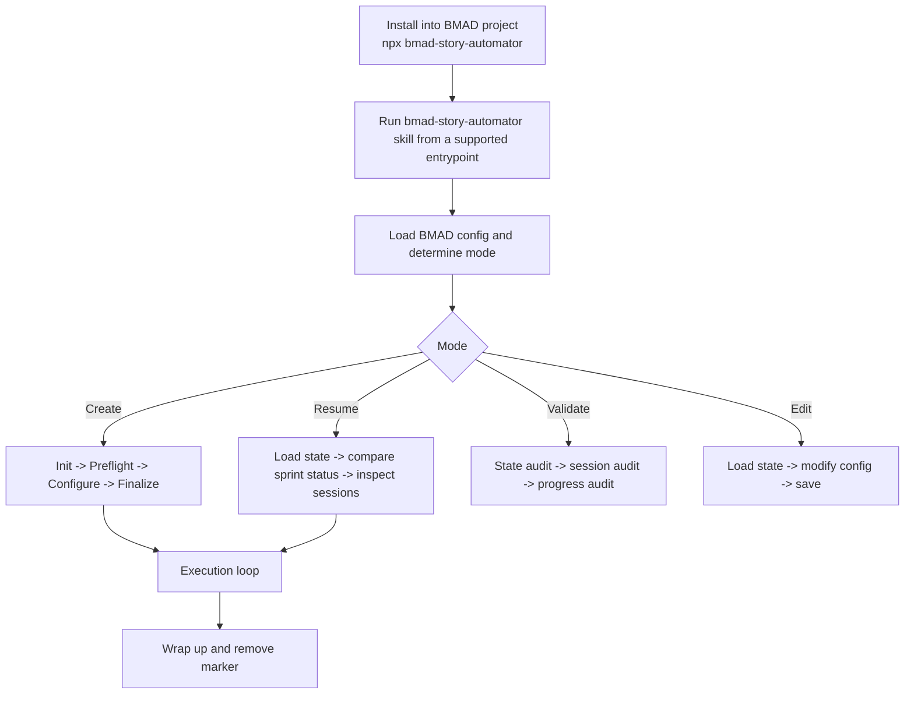
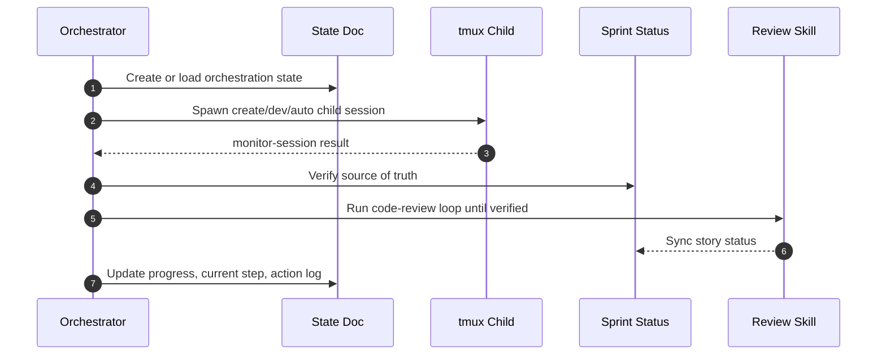

# Story Automator


Portable BMAD `bmad-story-automator` skill/plugin bundle. This repo packages:

- `skills/bmad-story-automator`
- `skills/bmad-story-automator-review`
- the Python helper runtime inside `skills/bmad-story-automator`

This is the Python port of [`bma-d/bmad-story-automator-go`](https://github.com/bma-d/bmad-story-automator-go). The Go README is the stylistic and operator-facing reference; this repo now documents the Python implementation in the same spirit, but with Python-specific behavior and Codex child-session support.

The root `skills/` folder follows the Claude skill convention: each skill is a directory with its own `SKILL.md`. You can copy either skill folder directly into `.claude/skills/`. The repo also includes `.claude-plugin/plugin.json`, so the same root layout can be loaded as a Claude Code plugin with `claude --plugin-dir .`.

## Claude Plugin Layout

This repo follows the Anthropic Claude Code plugin layout:

```text
.
├── .claude-plugin/
│   ├── plugin.json
│   └── marketplace.json
├── skills/
│   ├── bmad-story-automator/
│   │   └── SKILL.md
│   └── bmad-story-automator-review/
│       └── SKILL.md
├── bin/
└── README.md
```

- `.claude-plugin/plugin.json` is the plugin manifest.
- `.claude-plugin/marketplace.json` is the marketplace catalog entry.
- `skills/` stays at the plugin root, not inside `.claude-plugin/`.
- `bin/` stays at the plugin root so plugin executables can be added to Claude Code's Bash path.

Local plugin test:

```bash
claude --plugin-dir .
```

Local marketplace test:

```text
/plugin marketplace add .
/plugin install bmad-automator@bmad-plugins
```

## Quickstart

Install into the target BMAD project:

```bash
cd /absolute/path/to/your-bmad-project
npx bmad-story-automator
```

Or install from anywhere:

```bash
npx bmad-story-automator /absolute/path/to/your-bmad-project
```

Then run the installed skill from your supported entrypoint session:

```text
Use the bmad-story-automator skill.
```

Manual skill copy (replace `.claude` with `.agents` or `.codex` to match your runtime; the helper must stay executable):

```bash
SKILLS=.claude/skills   # or .agents/skills, or .codex/skills
cp -a skills/bmad-story-automator /absolute/path/to/project/$SKILLS/
cp -a skills/bmad-story-automator-review /absolute/path/to/project/$SKILLS/
chmod +x /absolute/path/to/project/$SKILLS/bmad-story-automator/scripts/story-automator
```

### Use From A Local Clone

To use your own clone (e.g. a fork) instead of the published npm package, run the bundled installer directly from the clone against your BMAD project:

```bash
git clone https://github.com/<you>/bmad-automator
cd bmad-automator
./install.sh /absolute/path/to/your-bmad-project    # or: node bin/bmad-story-automator /absolute/path/to/your-bmad-project
```

The installer preflights host tools (`bash`, `python3`, `jq`; warns on missing `tmux`) and requires the BMAD dependency skills (`bmad-create-story`, `bmad-dev-story`, `bmad-retrospective`) to already be installed in the project. Install BMAD-Method into the project first if they are missing.

### Starting The Orchestrator

The orchestrator is not a standalone process — it is a skill you invoke **inside a Claude Code (or Codex) session opened in the BMAD project root**. After installing, start a session there and say:

```text
Use the bmad-story-automator skill.
```

It then drives the deterministic helper CLI and spawns per-story `claude`/`codex` child sessions in tmux. **Skip Automate** is a preflight option: set it to `true` to skip the optional automated QA step (`bmad-qa-generate-e2e-tests`) when that skill is not installed.

## BMAD Method Install Channels

If you install Automator through the BMAD Method official module code `automator`, choose the channel explicitly.
Run these from the target BMAD project root, or add `--directory /absolute/path/to/your-bmad-project`.

Stable install, using the latest pure-semver tag:

```bash
npx bmad-method install --modules automator --all-stable --tools claude-code --yes
```

Stable pin to the first Codex-capable stable tag:

```bash
npx bmad-method install --modules automator --pin automator=v1.15.0 --tools codex --yes
```

Rollback to the pre-Codex stable tag if needed:

```bash
npx bmad-method install --modules automator --pin automator=v1.14.2 --tools claude-code --yes
```

Codex preview branch, only for testing unpublished follow-up fixes:

```bash
npx bmad-method install --custom-source https://github.com/bmad-code-org/bmad-automator@next/codex-runtime-support --tools codex --yes
```

Current caveat: the official registry sets `automator` to `default_channel: next`, so unqualified `--modules automator` and `--next automator` resolve to `main` HEAD. After this stable release lands on `main`, those commands include Codex support, but use `--all-stable` or `--pin` when you need reproducible stable behavior. For custom-source branch testing, verify the custom-source cache HEAD and installed runtime files instead of trusting installer exit status, summary text, or manifest channel fields alone.

## Expectations

- This is an orchestrator, not a correctness guarantee. Bad planning artifacts still produce bad implementation runs.
- The npm installer writes the skill into every supported dependency skill root that is complete: `.agents/skills`, `.claude/skills`, and/or `.codex/skills`.
- Child sessions can use Claude or Codex depending on agent configuration.
- Retrospectives inherit the configured primary agent by default, and can be overridden explicitly via `agentConfig`.
- The automator expects sprint planning to be complete before it starts.
- Review completion is gated by verification, not by child-session exit alone.
- If the optional QA automate skill is missing, install still succeeds, but runs should use `Skip Automate = true`.

## What This Is

Story Automator automates the BMAD implementation loop for one or more stories:

1. create story
2. implement story
3. optionally run automate/test generation
4. run adversarial code review with retries
5. commit verified work
6. trigger retrospective when an epic is fully complete

The core runtime model is:

- one orchestrator session
- one markdown state document
- many short-lived tmux child sessions
- one marker file guarding against accidental stop
- `sprint-status.yaml` plus story files as the source of workflow truth

## How It Works





Practical shape:

- create, resume, validate, and edit are first-class modes
- preflight complexity scoring happens before agent selection
- `done` is gated by review verification
- retrospectives fire inside the execution loop, per epic, not only at the very end

## Docs Map

- [How It Works](./docs/how-it-works.md)
- [Story Execution](./docs/story-execution.md)
- [State And Resume](./docs/state-and-resume.md)
- [Agents And Monitoring](./docs/agents-and-monitoring.md)
- [Installation And Layout](./docs/installation-and-layout.md)
- [Review Workflow](./docs/review-workflow.md)
- [CLI Reference](./docs/cli-reference.md)
- [Troubleshooting](./docs/troubleshooting.md)
- [Development](./docs/development.md)

## Requirements

Host requirements (all must be on `PATH`):

- `python3` 3.11+ — the helper runtime
- `bash` and `jq` — the orchestration steps build commands and parse the helper's JSON with `jq`; a missing `jq` makes those steps fail silently
- `tmux` — child agent sessions run in detached tmux panes
- `git` — used by `commit-ready` / `commit-story`
- a child agent CLI on `PATH`: `claude` (Claude Code) and/or `codex`
- `node` 18+ — only for the `npx` / `bin/bmad-story-automator` install path
- Linux or macOS. Windows is supported **only via WSL** — the npm launcher refuses native Windows, and `tmux` is POSIX-only.

Target project requirements:

- `_bmad/` project directory
- BMAD dependency skill entrypoints under at least one supported skill root (`.agents/skills`, `.claude/skills`, and/or `.codex/skills`):
  - `bmad-create-story`
  - `bmad-dev-story`
  - `bmad-retrospective`
  - optional `bmad-qa-generate-e2e-tests`

Claude-only, Codex-only, and mixed projects are all supported. The installer updates each supported root that already contains the required dependency `SKILL.md` files.

Dependency skill internals such as `workflow.md` are optional. If the QA skill is missing, install still succeeds. Run Story Automator with `Skip Automate = true` unless the QA skill is installed.

## Install Verification

Inside a target project, verify the installed package layout:

```bash
cd /path/to/project
found=0
for skills_root in .agents/skills .claude/skills .codex/skills; do
  if test -f "$skills_root/bmad-story-automator/SKILL.md"; then
    found=1
    test -f "$skills_root/bmad-story-automator-review/SKILL.md"
    test -x "$skills_root/bmad-story-automator/scripts/story-automator"
  fi
done
test "$found" -eq 1
```

Expected:

- helper CLI prints usage
- the main skill exists
- the bundled review gate exists
- the skill is installed under each complete supported dependency skill root

## Development Verification

```bash
npm run verify
PYTHONPATH=skills/bmad-story-automator/src python3 -m story_automator --help
```

More: [Development](./docs/development.md)

## Publish To npm

Publish steps:

- `npm adduser`
- `npm publish`

More: [Development](./docs/development.md#release)

For BMAD Method stable tags, preview tags, registry `next`, and npm dist-tags,
see [Versioning And Release Channels](./docs/versioning.md).
