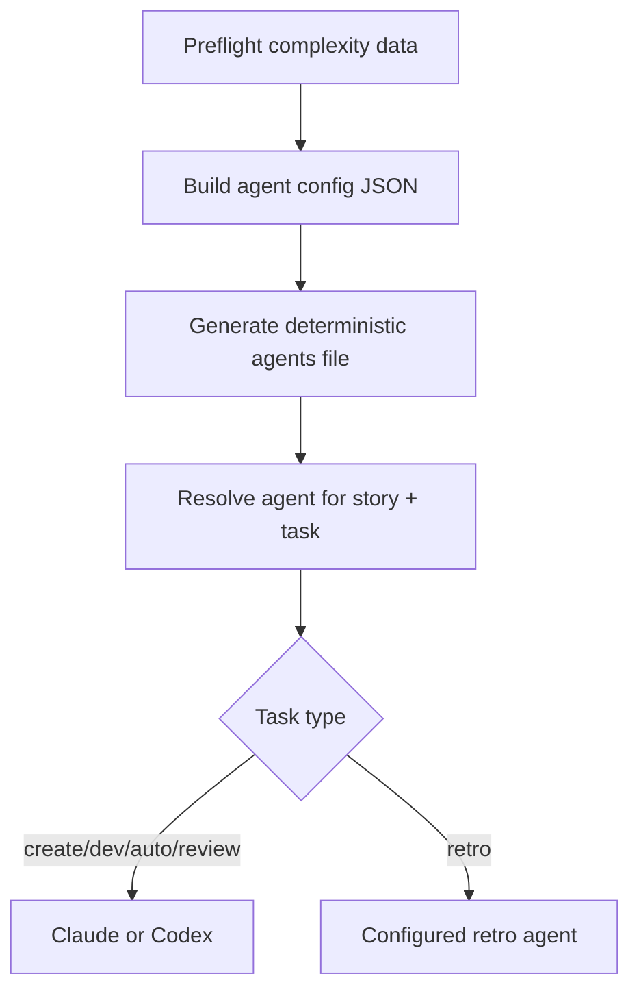
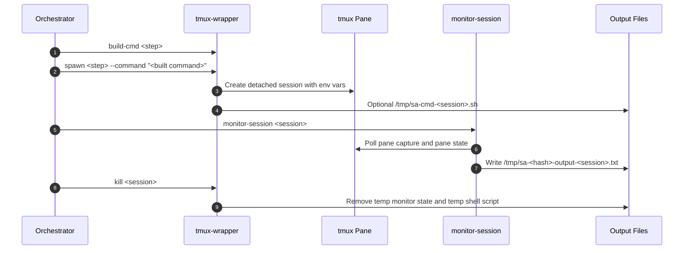
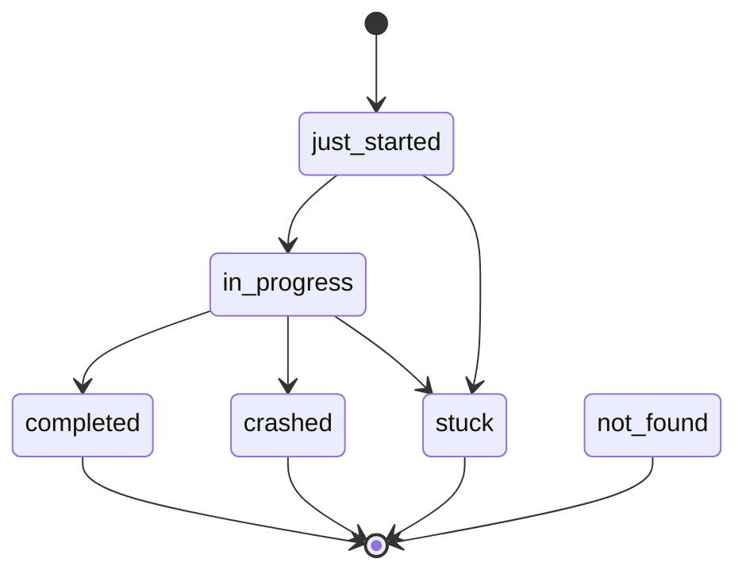
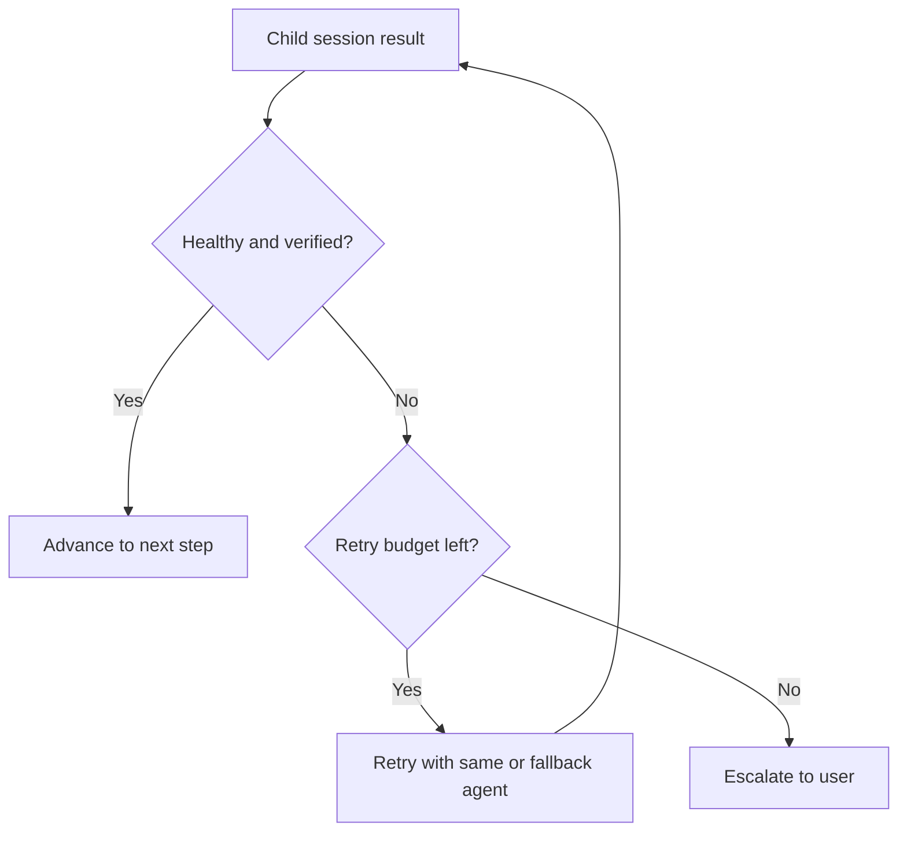

# Agents And Monitoring

This doc explains how Story Automator chooses child agents, builds child-session commands, and decides whether a tmux session is active, completed, stuck, or incomplete.

## Agent Model

There are two distinct agent layers:

- the orchestrator itself, which runs from a supported top-level agent session
- child sessions, which can run Claude or Codex depending on the agent plan

Agent selection is driven by:

- default primary and fallback values
- per-task overrides
- complexity-based overrides
- retro-specific rule: retrospective uses the configured retro agent

## Agent Resolution

The generated agents file is a runtime artifact, not just display text.

## Child-Session Command Build

The helper CLI generates step-specific commands with `tmux-wrapper build-cmd`.

Examples:

- `create`
- `dev`
- `auto`
- `review`
- `retro`

Important behavior:

- child sessions are always spawned through `tmux-wrapper spawn`
- `--command` is mandatory
- long commands are written to `/tmp/sa-cmd-<session>.sh`
- review and retro prompts are assembled from resolved sibling skill/workflow files

## tmux Lifecycle

Environment details:

- `STORY_AUTOMATOR_CHILD=true`
- `AI_AGENT=<claude|codex>`
- Codex child sessions use isolated `CODEX_HOME` under `/tmp`

## Claude vs Codex

Python Story Automator does support Codex child sessions.

That is a major difference from the older Go README guidance.

Important Codex-specific behavior:

- Codex child sessions use isolated `CODEX_HOME`
- auth is symlinked into that temp home
- plugins, sqlite, and shell-snapshot are disabled for quieter child startups
- approval policy is set to `never`
- high reasoning is kept for child sessions

## Monitoring States

`monitor-session` polls helper status and collapses it into a small set of orchestration outcomes.

Important distinctions:

- `completed` means the CLI exited or verification passed
- `in_progress` means the child still looks alive or recently active
- `stuck` means no valid progress signal within the allowed window
- `incomplete` is a review-specific result, not a generic session state

## Review Verification

Review sessions add extra verification:

- pass `--workflow review --story-key <story>`
- verify sprint status or story-file status before accepting completion

This is what prevents false positives where a review session exits but the story was never marked done.

## Output Files And Scratch Data

During monitoring, the runtime may write:

- `/tmp/sa-<hash>-output-<session>.txt`
- `/tmp/.sa-<hash>-session-<session>-state.json`
- `/tmp/sa-cmd-<session>.sh`

These are runtime scratch files. They are cleaned on normal session kill.

## Retry And Escalation

Escalation is intentionally the last step, not the first response.

## Practical Operator Notes

- if a child session looks done but review verification fails, treat it as incomplete, not complete
- if a long command is involved, the child may be running through a temp shell script rather than directly
- if monitor output is suspicious, re-check tmux and sprint-status directly

## Read Next

- [Review Workflow](./review-workflow.md)
- [Troubleshooting](./troubleshooting.md)
