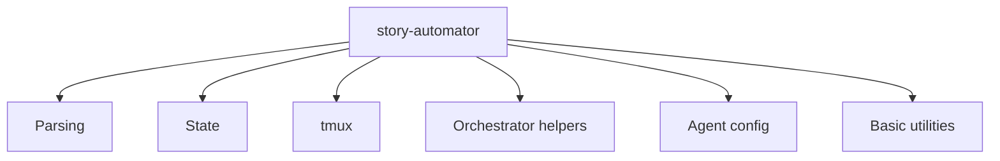

# CLI Reference

The installed helper command is under each installed skill root:

```text
<installed-skill-root>/bmad-story-automator/scripts/story-automator
```

It exposes one flat command surface with grouped responsibilities.

## Command Families



## Parsing Commands

- `parse-epic --file <path>`
- `parse-story --epic <path> --story <id> --rules <file>`
- `parse-story-range --input <selection> --total <count> --ids <csv>`
- `epic-complete --epic <path> --range <csv>`

Use these during preflight to keep story selection and complexity scoring deterministic.

## State Commands

- `build-state-doc`
- `state-metrics --state <file>`
- `validate-state --state <file>`
- `sprint-compare --state <file> --sprint <file>`

Use these to create, inspect, and validate orchestration state.

`validate-state` preserves the legacy response fields:

- `ok`
- `structure`
- `issues`

It also adds `structuredIssues` and `issueCount` for field-specific diagnostics. Consumers should prefer `structuredIssues` when present and keep `issues` as the legacy fallback.

## Diagnostic Events

Command stdout stays backward-compatible. Set `STORY_AUTOMATOR_DIAGNOSTICS_FILE=/path/to/events.jsonl` to opt in to structured diagnostic events. The helper appends one redacted JSON object per line for orchestration-stage parse results, state transitions, monitor-session lifecycle results, and policy load failures.

## tmux Commands

- `tmux-wrapper spawn`
- `tmux-wrapper build-cmd`
- `tmux-wrapper kill`
- `tmux-wrapper list`
- `monitor-session`
- `tmux-status-check`
- `codex-status-check`
- `heartbeat-check`

Critical rule:

- always pass `--command` to `tmux-wrapper spawn`

## Orchestrator Helper Commands

- `orchestrator-helper sprint-status get|exists|check-epic`
- `orchestrator-helper state-list`
- `orchestrator-helper state-latest`
- `orchestrator-helper state-latest-incomplete`
- `orchestrator-helper state-summary`
- `orchestrator-helper state-update`
- `orchestrator-helper marker create|remove|check|heartbeat`
- `orchestrator-helper verify-step`
- `orchestrator-helper verify-code-review`
- `orchestrator-helper get-epic-stories`
- `orchestrator-helper check-epic-complete`
- `orchestrator-helper agents-build`
- `orchestrator-helper agents-resolve`

These commands are the orchestration control plane.

`orchestrator-helper state-update <file> --set status=<value>` validates status transitions before writing. Invalid transitions return `ok:false`, `error:"invalid_status_transition"`, `currentStatus`, `attemptedStatus`, `allowedTransitions`, legacy `issues`, and `structuredIssues`. Non-status updates keep the existing `ok` and `updated` response shape.

## Agent Config Commands

- `agent-config list`
- `agent-config save`
- `agent-config ...`

These support saved presets and generated agent plans.

## Basic Utility Commands

- `derive-project-slug`
- `ensure-marker-gitignore`
- `ensure-stop-hook`
- `stop-hook`
- `list-sessions`
- `commit-story`
- `validate-story-creation` (legacy compatibility wrapper; prefer `orchestrator-helper verify-step create`)

## Typical Patterns

Start by resolving the installed helper from the supported skill roots:

```bash
scripts=""
for root in .agents/skills .claude/skills .codex/skills; do
  candidate="$root/bmad-story-automator/scripts/story-automator"
  if [ -x "$candidate" ]; then
    scripts="$candidate"
    break
  fi
done
[ -n "$scripts" ] || { echo "story-automator not found in supported skill roots" >&2; exit 1; }
```

### Build And Spawn

```bash
cmd="$("$scripts" tmux-wrapper build-cmd review 1.2 --agent claude)"
session="$("$scripts" tmux-wrapper spawn review 1 1.2 --agent claude --command "$cmd")"
```

### Monitor With Review Verification

```bash
"$scripts" monitor-session "$session" --json --agent claude --workflow review --story-key 1.2
```

### Resolve Agent For A Story Task

```bash
"$scripts" orchestrator-helper agents-resolve --state-file "$state_file" --story 1.2 --task review
```

### Verify Create Success

```bash
"$scripts" orchestrator-helper verify-step create 1.2 --state-file "$state_file"
```

Legacy compatibility:

```bash
"$scripts" validate-story-creation check 1.2 --state-file "$state_file"
```

## Read Next

- [Agents And Monitoring](./agents-and-monitoring.md)
- [Troubleshooting](./troubleshooting.md)
