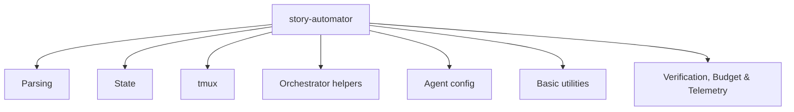

# CLI Reference

The installed helper command is under each installed skill root:

```text
<installed-skill-root>/bmad-story-automator/scripts/story-automator
```

It exposes one flat command surface with grouped responsibilities.

## Command Families



## Parsing Commands

- `parse-epic --file <path>`
- `parse-story --epic <path> --story <id> --rules <file>`
- `parse-story-range --input <selection> --total <count> --ids <csv>`
- `epic-complete --epic <path> --range <csv>`

Use these during preflight to keep story selection and complexity scoring deterministic.

## State Commands

- `build-state-doc`
- `state-metrics --state <file>`
- `validate-state --state <file>`
- `sprint-compare --state <file> --sprint <file>`

Use these to create, inspect, and validate orchestration state.

## tmux Commands

- `tmux-wrapper spawn`
- `tmux-wrapper build-cmd`
- `tmux-wrapper kill`
- `tmux-wrapper list`
- `monitor-session`
- `tmux-status-check`
- `codex-status-check`
- `heartbeat-check`

Critical rule:

- always pass `--command` to `tmux-wrapper spawn`

## Orchestrator Helper Commands

- `orchestrator-helper sprint-status get|exists|check-epic`
- `orchestrator-helper parse-output <file> <step> [--state-file F]`
- `orchestrator-helper state-list`
- `orchestrator-helper state-latest`
- `orchestrator-helper state-latest-incomplete`
- `orchestrator-helper state-summary`
- `orchestrator-helper state-update`
- `orchestrator-helper marker path|create|remove|check|heartbeat`
- `orchestrator-helper escalate <trigger> <context> [--state-file F]`
- `orchestrator-helper commit-ready <story_id>`
- `orchestrator-helper normalize-key <input> [--to id|key|prefix|json]`
- `orchestrator-helper story-file-status <story>`
- `orchestrator-helper verify-step`
- `orchestrator-helper verify-code-review`
- `orchestrator-helper get-epic-stories`
- `orchestrator-helper check-epic-complete`
- `orchestrator-helper check-blocking <story_id>`
- `orchestrator-helper agents-build`
- `orchestrator-helper agents-resolve`
- `orchestrator-helper retro-agent --state-file <path>`

These commands are the orchestration control plane. `escalate`, `commit-ready`,
`marker create`, `verify-code-review`, `check-blocking`, `agents-resolve`, and
`retro-agent` also emit M01/M02 telemetry events carrying the per-run `run_id`
correlation key derived from the active marker.

## Agent Config Commands

- `agent-config list`
- `agent-config save`
- `agent-config load --file F --name N`
- `agent-config delete --file F --name N`

These support saved presets and generated agent plans.

## Verification, Budget & Telemetry Commands

These commands wire the runtime's safety, verification, and telemetry building
blocks onto the flat CLI surface. Each prints a single compact JSON object to
stdout (so BMAD step markdown can branch via `jq`) and is read-only with respect
to source state unless noted.

- `ceiling-check --gate <init|story_start|retry_start> [--events <jsonl>]` —
  evaluates the M03 budget ceilings and prints an `ALLOW` / `WARN` / `BLOCK`
  verdict. Read-only: never writes the ledger, never prompts.
- `trust_verify --diff <path> --gaps <path> --spec <path>` — chains the three
  M06a trust-but-verify layers (gap validation, spec compliance, feature
  testing), derives a single `pass` / `warn` / `block` decision, and writes the
  five-key result to `.claude/trust-verify-output/result.json`. Exit code:
  `0` on pass/warn, `2` on block (so the step can halt), `1` on input error.
- `telemetry-report [--events <jsonl>] [--epic <id>] [--report <kind>] [--tail <N>]` —
  aggregates the M02 telemetry stream into rollups (cost-by-epic,
  retry-attempts-by-story, per-epic retro inputs). `--tail <N>` instead streams
  the last `N` raw events (a live-debug view that tolerates a corrupt tail line
  rather than aborting); the rollups still fail loud on corruption.
- `doctor [--human]` — operator preflight: checks the Python version, the
  `filelock`/`psutil` dependencies, `tmux`/`claude`/`codex`/`git` on `PATH`, free
  disk, `BMAD_AUDIT_KEY` length, bundled-config JSON validity, and the
  file-descriptor limit. Read-only; exits non-zero only on a hard `fail`
  (missing dependency or no agent CLI). `--human` adds a readable summary on
  stderr.
- `calibration [--events <jsonl>] [--model <id>] [--task <kind>] [--report]` —
  prints the M08 per-`(model_id, task_kind)` success-rate table. A missing
  ledger is not an error (empty table, `ok:true`).
- `drift --baseline <jsonl> --current <jsonl> [--format json|text]` — computes
  the M09 drift report between two calibration snapshots.
- `triage [--json <event>]` — classifies a single telemetry event (read from
  `--json` or stdin) into an M07 failure-triage verdict
  (`failure_class` / `confidence`).
- `audit-verify [--project-root <path>]` — verifies the M04 hash-chained audit
  log and prints `valid` + `last_valid_seq`. The audit key is loaded from the
  environment and never echoed.
- `record-cost --epic <id> --model <id> --cost-usd <n> [--tokens-in <n>] [--tokens-out <n>] [--story-key <key>] [--phase <name>] [--run-id <id>] [--now <iso>]` —
  the cost ingestion primitive: appends one `CostCharged` row to
  `telemetry/events.jsonl` so `ceiling-check` and `telemetry-report` reflect
  real spend (closes the inert-ceiling gap).

Note: `trust_verify` is registered with an underscore (per the bundled skill
contract); the other commands use hyphens.

## Basic Utility Commands

- `derive-project-slug`
- `ensure-marker-gitignore`
- `ensure-stop-hook`
- `stop-hook`
- `list-sessions`
- `commit-story`
- `validate-story-creation` (legacy compatibility wrapper; prefer `orchestrator-helper verify-step create`)

## Typical Patterns

Start by resolving the installed helper from the supported skill roots:

```bash
scripts=""
for root in .agents/skills .claude/skills .codex/skills; do
  candidate="$root/bmad-story-automator/scripts/story-automator"
  if [ -x "$candidate" ]; then
    scripts="$candidate"
    break
  fi
done
[ -n "$scripts" ] || { echo "story-automator not found in supported skill roots" >&2; exit 1; }
```

### Build And Spawn

```bash
cmd="$("$scripts" tmux-wrapper build-cmd review 1.2 --agent claude)"
session="$("$scripts" tmux-wrapper spawn review 1 1.2 --agent claude --command "$cmd")"
```

### Monitor With Review Verification

```bash
"$scripts" monitor-session "$session" --json --agent claude --workflow review --story-key 1.2
```

### Resolve Agent For A Story Task

```bash
"$scripts" orchestrator-helper agents-resolve --state-file "$state_file" --story 1.2 --task review
```

### Verify Create Success

```bash
"$scripts" orchestrator-helper verify-step create 1.2 --state-file "$state_file"
```

Legacy compatibility:

```bash
"$scripts" validate-story-creation check 1.2 --state-file "$state_file"
```

## Error Contract

Commands emit machine-readable JSON on stdout. On failure they print a single
object of the form `{"ok": false, "error": "<code>", ...}` and return a non-zero
exit code, so step scripts can branch on `.error` via `jq`. The error `code` is
a stable snake_case token. Common codes:

| Code | Meaning |
|------|---------|
| `internal_error` | An unexpected exception was caught by the top-level boundary in `main` (the `detail` field carries the message). |
| `file_not_found` / `folder_not_found` | A required path argument did not resolve. |
| `invalid_json` / `invalid_config_json` | A file that must contain JSON was malformed. |
| `invalid_rules_file` | The complexity-rules file parsed to JSON but is not an object. |
| `missing_input_or_total` | `parse-story-range` was given no/invalid `--input` or `--total`. |
| `invalid_set_operand` | `state-update --set` received an operand with no `=`. |
| `marker_corrupt` / `marker_unreadable` | The active-run marker could not be parsed/read. |
| `run_already_active` | `marker create` refused to clobber a live run's marker. |
| `audit_key_missing` | `audit-verify` found no `BMAD_AUDIT_KEY` in the environment. |
| `invalid_gate` | `ceiling-check` was given a `--gate` outside `init`/`story_start`/`retry_start`. |
| `corrupt_telemetry` / `invalid_event` | A telemetry line/event could not be parsed. |
| `invalid_report` / `invalid_tail` | `telemetry-report` got an unknown `--report` value or a non-numeric `--tail`. |
| `io_error` | A read/write failed with an OS-level error (the `detail` field carries it). |
| `missing_config` / `missing_template_or_output` | `build-state-doc` got no/empty/non-object config JSON, or a missing template/output folder. |
| `missing_args` / `missing_required_args` / `missing_subcommand` / `unknown_subcommand` | A command was invoked without its required flags or with an unknown subcommand. |
| `missing_slug` / `missing_epic` / `missing_epic_or_story` / `missing_events` / `missing_gate` | A specific required flag was absent for the named command. |
| `epic_file_not_found` / `rules_file_not_found` / `spec_file_not_found` / `gaps_file_not_found` / `diff_file_not_found` | A required input file did not resolve. |
| `gaps_unreadable` / `diff_unreadable` | A `--gaps`/`--diff` path exists but could not be read (e.g. a directory or permission error). |
| `agents_file_not_found` / `agents_json_missing` / `story_not_found` / `task_not_found` / `preset_not_found` | An agents-plan lookup found no file, no embedded JSON, or no matching story/task/preset. |
| `tmux_not_found` | `tmux` is not on `PATH` (run `doctor` to confirm the environment). |
| `repo_not_found` / `no_changes` / `git_status_failed` / `git_add_failed` / `commit_failed` | A `commit-story` git step could not complete. |
| `run_already_active` / `run_lock_busy` | A run lock is held by a live owner; another run is in progress. |
| `policy_snapshot_failed` | The effective runtime policy could not be snapshotted (the `reason` field carries why). |
| `no_stories_found` / `no_incomplete_state` / `state_not_found` / `sprint_not_found` | A state/sprint lookup matched nothing. |
| `layer2_failed` / `layer3_failed` | A `trust_verify` spec-compliance / feature-test layer could not run on the given input. |

This vocabulary is additive: new codes may be introduced, but existing codes
keep their meaning. The table above covers the operationally common codes; for
an exhaustive, always-current list, grep the source:

```bash
grep -rhoE '"error":\s*"[a-z_]+"' skills/bmad-story-automator/src | sort -u
```

A `version` command and `--version`/`-v` flag report the runtime version for
compatibility checks. Run `doctor` for a one-shot environment preflight.

## Read Next

- [Agents And Monitoring](./agents-and-monitoring.md)
- [Troubleshooting](./troubleshooting.md)
- [Operations & Recovery](./operations.md)
