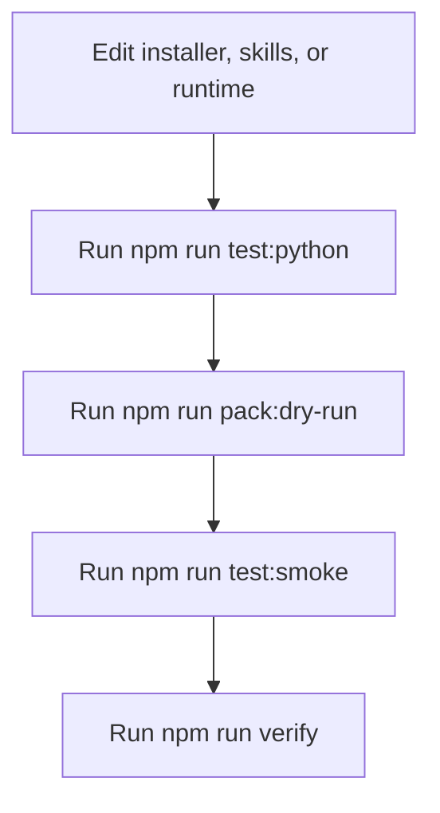

# Development

This doc covers local verification, smoke testing, packaging, and release steps for this repo itself.

## Local Verify

Primary checks:

```bash
npm run verify
PYTHONPATH=skills/bmad-story-automator/src python3 -m story_automator --help
```

`npm run verify` expands to:

- `npm run test:python`
- `npm run pack:dry-run`
- `npm run test:smoke`

## Smoke Test Coverage

The smoke suite validates:

- installer behavior
- packed `npx` install behavior from the generated tarball
- required and optional dependency handling
- legacy backup behavior
- installed skill layout
- installed runtime policy, prompt templates, and parse contracts
- prompt-building behavior for Claude and Codex child sessions

## Repo Verification Flow



## Packaging Surface

Important package parts:

- `bin/bmad-story-automator`
- `install.sh`
- `skills/`
- `skills/bmad-story-automator/`
- `README.md`
- `ref.png`

The published package bundles the root `skills/` tree. The main skill contains the Python runtime source, so copied skills and npm installs use the same files.

## Runtime Entry During Development

The shell wrapper used in installed projects is mirrored in this repo:

```text
skills/bmad-story-automator/scripts/story-automator
```

It runs:

```text
python3 -m story_automator
```

with `PYTHONPATH` pointed at `skills/bmad-story-automator/src`.

## Legacy Env Compatibility

For one release cycle, fresh orchestration starts still honor:

- `MAX_REVIEW_CYCLES`
- `MAX_CRASH_RETRIES`

Those values are resolved once during snapshot creation. Resume paths read the pinned snapshot, not the current shell env. Prefer `_bmad/bmm/story-automator.policy.json` for new configuration changes.

## What To Re-Check After Runtime Changes

If you change:

- `commands/tmux.py`: re-check spawn, command building, monitor behavior, Codex vs Claude handling
- `commands/orchestrator.py`: re-check state summary, marker behavior, sprint-status verification
- `install.sh`: re-check dependency validation, copy layout, backups, shim cleanup
- skill step files: re-check docs, prompts, and smoke expectations

## Release

Publish steps:

- `npm adduser`
- `npm publish`

Recommended release checklist:

1. `npm run verify`
2. use `secrets` skill for npm auth material; search exact key names, then `secrets load <KEY>` into the publish shell; never print token values
3. inspect the package dry-run output
4. confirm README and docs match shipped behavior
5. publish

For BMAD Method stable tags, preview tags, registry `next`, and npm dist-tags,
use [Versioning And Release Channels](./versioning.md).

## Read Next

- [Installation And Layout](./installation-and-layout.md)
- [CLI Reference](./cli-reference.md)
- [Versioning And Release Channels](./versioning.md)
