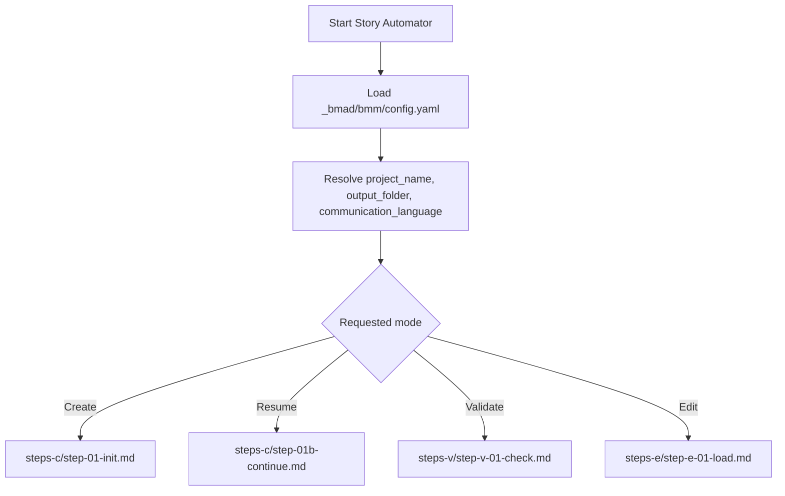
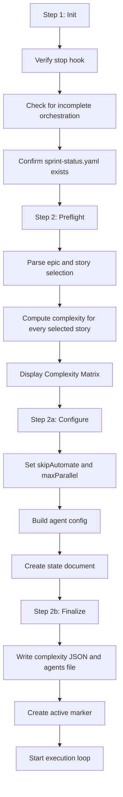
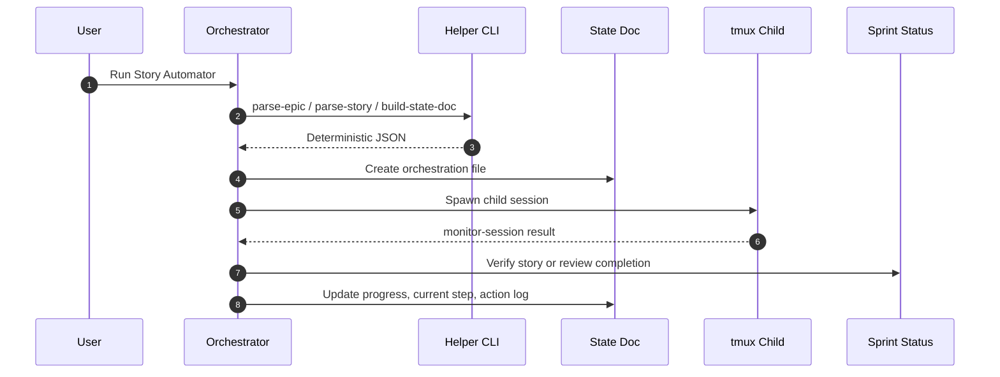

# How It Works

This doc explains the orchestration model: how Story Automator decides what mode it is in, what happens during preflight, and how the state document, tmux sessions, and sprint status fit together.

## The Core Model

Story Automator is a BMAD orchestrator that can coordinate Claude or Codex child workflows in isolated tmux sessions.

The important parts are:

- the main installed skill under each qualifying dependency skill root
- the helper CLI at `scripts/story-automator`
- the markdown orchestration state document
- sibling BMAD skills such as `bmad-create-story`, `bmad-dev-story`, `bmad-retrospective`, and optional `bmad-qa-generate-e2e-tests`
- the bundled `bmad-story-automator-review` skill
- `sprint-status.yaml` as the implementation-progress source of truth

## Mode Routing

The orchestrator supports four modes.

Mode meanings:

- `Create`: start a new orchestration
- `Resume`: continue a saved orchestration from its last safe step
- `Validate`: audit state integrity and progress consistency
- `Edit`: modify orchestration configuration and optionally resume

## Step-File Architecture

The workflow is intentionally split into many small files.

- `workflow.md` decides mode and routes to the first step
- `steps-c/` owns create and execution phases
- `steps-v/` owns validation
- `steps-e/` owns edit flows
- `data/` holds execution rules, retry guidance, parsing contracts, and operator prompts
- `templates/` holds the state-document template

This is not just organization. It is an execution rule:

- read the current step file completely
- follow it in order
- update state
- then move to the next step

## Create Flow

Key rules:

- stop-hook must exist before execution can continue
- `sprint-status.yaml` must exist before create mode can continue
- complexity must be computed programmatically before agent selection
- the state doc is created before execution starts

## Component Interaction

The helper CLI exists so the skill does not need to do everything through raw shell parsing or manual markdown edits.

## Why The State Document Matters

The state document is the control plane for the run.

It records:

- current orchestration status
- current story and current step
- overrides such as `skipAutomate` and `maxParallel`
- agent configuration
- references to generated complexity and agent-plan files
- progress table for each story
- action log
- active and completed sessions

Without it, resume, validation, and edit mode would be guesswork.

## Source Of Truth Rules

Story Automator distinguishes between orchestration state and workflow truth.

- orchestration state lives in the markdown state file
- session state lives in tmux plus helper-generated capture files
- workflow truth lives in `sprint-status.yaml` and story files

That distinction matters most during review:

- a child session exiting does not automatically mean the story is done
- review completion is verified against sprint status or story-file status
- monitor output is advisory; verification comes from the workflow artifacts

## Multi-Epic Behavior

If the selected range spans multiple epics:

- stories are still processed in order
- epic completion is checked after each story
- retrospective is triggered per epic when every story in that epic is done
- one failed retrospective does not block later stories or epics

## Read Next

- [Story Execution](./story-execution.md)
- [State And Resume](./state-and-resume.md)
- [Agents And Monitoring](./agents-and-monitoring.md)
