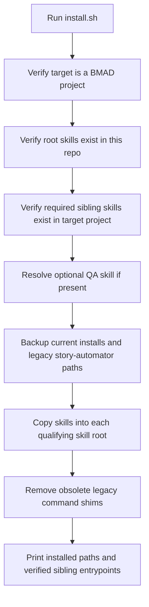
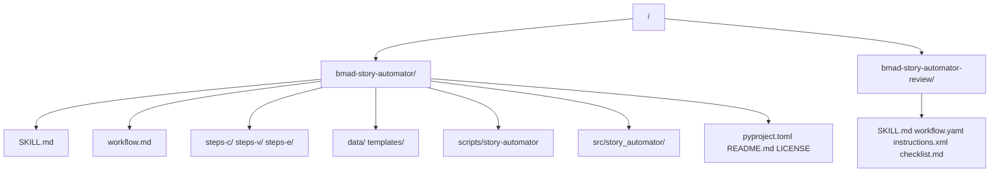

# Installation And Layout

This doc explains what `npx bmad-story-automator` installs, what it requires, and how it handles migration from older installs.

## BMAD Method Channels

Automator is also available through the BMAD Method official module code `automator`. Because the official registry currently sets `automator` to `default_channel: next`, channel selection must be explicit:

- `--modules automator --all-stable` resolves to the latest pure-semver stable tag.
- `--pin automator=v1.15.0` resolves to the first Codex-capable stable tag.
- `--pin automator=v1.14.2` resolves to the pre-Codex stable tag and is the safest rollback path for Claude Code users.
- `--custom-source https://github.com/bmad-code-org/bmad-automator@next/codex-runtime-support` resolves to the branch preview for unpublished follow-up fixes.
- Unqualified `--modules automator` and `--next automator` resolve to `main` HEAD while `default_channel: next` remains. After Codex support lands on `main`, those commands include Codex support but are not reproducible stable installs.

Run these commands from the target BMAD project root, or add `--directory /absolute/path/to/your-bmad-project`.

Stable install:

```bash
npx bmad-method install --modules automator --all-stable --tools claude-code --yes
```

Stable pin:

```bash
npx bmad-method install --modules automator --pin automator=v1.15.0 --tools codex --yes
```

Pre-Codex rollback:

```bash
npx bmad-method install --modules automator --pin automator=v1.14.2 --tools claude-code --yes
```

Branch preview install for unpublished follow-up fixes:

```bash
npx bmad-method install --custom-source https://github.com/bmad-code-org/bmad-automator@next/codex-runtime-support --tools codex --yes
```

Rollback from preview or branch testing to the pre-Codex stable tag:

```bash
npx bmad-method install --modules automator --pin automator=v1.14.2 --tools claude-code --yes
```

or:

```bash
npx bmad-method install --modules automator --all-stable --tools claude-code --yes
```

If custom-source discovery asks which plugin to install after reading the branch, choose `bmad-automator`. For custom-source branch testing, confirm the custom-source cache HEAD and installed runtime files; installer metadata can still report the registry `next` ref when the custom source uses official module code `automator`.

The BMAD Method commands above install through `bmad-method` for the requested `--tools` target. The sections below describe the standalone `npx bmad-story-automator` installer and its layout behavior.

## Installer Flow



## Target Paths

The npm installer writes into every qualifying skill root.

Terminology:

- Supported roots are `.agents/skills`, `.claude/skills`, and `.codex/skills`.
- Qualifying roots are supported roots that contain the required dependency skill entrypoints (`SKILL.md`).
- Installed skill roots are the qualifying roots where `bmad-story-automator` and `bmad-story-automator-review` are copied.

Supported roots:

- `.agents/skills`
- `.claude/skills`
- `.codex/skills`

Unlike the older workflow-root layout, this Python port installs into the pure skill tree.
Use `.agents/skills` when you want a shared skill tree that multiple runtimes can see. Use `.claude/skills` or `.codex/skills` when provider-specific isolation is useful. Runtime provider/layout is still resolved separately from install targets: explicit provider env wins first, then active skill-root context, then project-layout fallback. In that fallback, active `.agents` or `.codex` roots map to Codex-style hook/config layout, while `.claude` maps to Claude-style layout.

Installer behavior and runtime behavior are different:

- The installer has no precedence among qualifying roots; it updates every qualifying root it finds.
- Runtime resolution does have an order for active execution context: explicit `BMAD_SKILLS_ROOT`, current installed helper root, project `.agents`, project `.claude`, project `.codex`, then home roots.

Claude-only, Codex-only, and mixed projects are supported. If more than one root contains all required dependency `SKILL.md` files, the installer updates each qualifying root. If a root is present but missing required skill entrypoints while another root qualifies, the incomplete root is left unchanged.

The repo-local source skills live under `skills/`. The installer copies those same directly usable skill folders into each qualifying root.

## Installed Tree



## Required Inputs

The target project must already contain these BMAD skills under at least one supported skill root:

- `bmad-create-story`
- `bmad-dev-story`
- `bmad-retrospective`

Only the `SKILL.md` entrypoint is required for sibling BMAD skills. Extra files such as `workflow.md`, `workflow.yaml`, checklists, and templates are resolved when present, but install must not depend on those internal layouts.

If the required dependency skills are missing from all supported roots, the installer exits before copying anything and reports the supported roots that can satisfy the dependency requirement.

Optional:

- `bmad-qa-generate-e2e-tests`

If the optional QA skill is missing:

- install still succeeds
- a warning is printed
- the operator should run with `Skip Automate = true`

## Migration And Backups

Before copying new content, the installer backs up the existing install targets under each qualifying skill root:

- existing `bmad-story-automator`
- existing `bmad-story-automator-review`
- legacy installs under `_bmad/bmm/4-implementation/...`
- legacy installs under `_bmad/bmm/workflows/4-implementation/...`

The goal is migration safety, not in-place overwrite.

## Command Shim Cleanup

The installer removes obsolete shims only when they still target legacy workflow-root installs.

Important nuance:

- this repo does not generate new Claude command wrappers
- it only cleans up stale legacy wrappers
- the intended entrypoint is the installed skill itself

## Runtime Entry

The installed helper entrypoint is:

```text
<installed-skill-root>/bmad-story-automator/scripts/story-automator
```

Codex uses the active installed skill root for this helper, but writes hook/config state to `.codex/hooks.json` and `.codex/config.toml`.

That wrapper:

- sets `PYTHONPATH` to the bundled `src`
- runs `python3 -m story_automator`

## Runtime Provider Resolution

Top-level runtime behavior is resolved separately from child-agent selection:

- runtime provider decides hook/config syntax
- child-agent selection decides whether spawned work uses Claude or Codex

Provider resolution checks, in order:

1. `BMAD_RUNTIME_PROVIDER`
2. `STORY_AUTOMATOR_RUNTIME_PROVIDER`
3. installed/current story-automator skill root
4. project-local runtime layout fallback

`AI_AGENT` is only for spawned child sessions. It does not decide whether `ensure-stop-hook` writes `.claude/settings.json` or `.codex/{config.toml,hooks.json}`.

## Repo Layout

Repo layout:

- `skills/` for directly copyable skill folders
- `skills/bmad-story-automator/` for the main skill and bundled Python runtime
- `skills/bmad-story-automator-review/` for the bundled review skill
- `.claude-plugin/plugin.json` for Claude Code plugin loading
- `install.sh` for installation logic
- `bin/bmad-story-automator` for npm entrypoint
- `scripts/` for repo-level smoke verification

No installer-only payload tree exists. The installer copies the same skill folders that can be manually copied into `.claude/skills/`.

## Operator Notes

- install target must be a BMAD project with `_bmad/`
- required sibling skill `SKILL.md` files must already exist under `.agents/skills`, `.claude/skills`, or `.codex/skills`
- the review workflow is installed alongside the main orchestrator because review gating is part of completion semantics
- Windows support currently means Windows via WSL, not native Windows shells

## Read Next

- [How It Works](./how-it-works.md)
- [CLI Reference](./cli-reference.md)
- [Development](./development.md)
