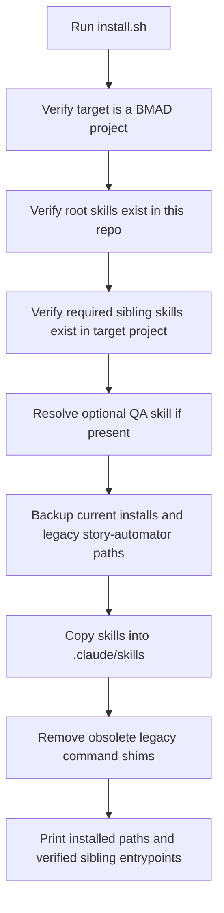
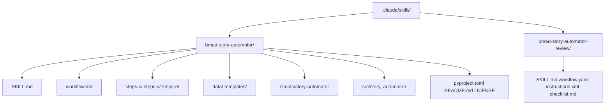

# Installation And Layout

This doc explains what `npx bmad-story-automator` installs, what it requires, and how it handles migration from older installs.

## Installer Flow



## Target Paths

The installer writes into the target project:

- `.claude/skills/bmad-story-automator`
- `.claude/skills/bmad-story-automator-review`

Unlike the older workflow-root layout, this Python port installs into the pure skill tree.

## Installed Tree



## Required Inputs

The target project must already contain these BMAD skills:

- `.claude/skills/bmad-create-story/SKILL.md`
- `.claude/skills/bmad-dev-story/SKILL.md`
- `.claude/skills/bmad-retrospective/SKILL.md`

Only the `SKILL.md` entrypoint is required for sibling BMAD skills. Extra files such as `workflow.md`, `workflow.yaml`, checklists, and templates are resolved when present, but install must not depend on those internal layouts.

Optional:

- `.claude/skills/bmad-qa-generate-e2e-tests/SKILL.md`

If the optional QA skill is missing:

- install still succeeds
- a warning is printed
- the operator should run with `Skip Automate = true`

## Migration And Backups

Before copying new content, the installer backs up:

- existing `.claude/skills/bmad-story-automator`
- existing `.claude/skills/bmad-story-automator-review`
- legacy installs under `_bmad/bmm/4-implementation/...`
- legacy installs under `_bmad/bmm/workflows/4-implementation/...`

The goal is migration safety, not in-place overwrite.

## Command Shim Cleanup

The installer removes obsolete shims only when they still target legacy workflow-root installs.

Important nuance:

- this repo does not generate new Claude command wrappers
- it only cleans up stale legacy wrappers
- the intended entrypoint is the installed skill itself

## Runtime Entry

The installed helper entrypoint is:

```text
.claude/skills/bmad-story-automator/scripts/story-automator
```

That wrapper:

- sets `PYTHONPATH` to the bundled `src`
- runs `python3 -m story_automator`

## Repo Layout

Repo layout:

- `skills/` for directly copyable skill folders
- `skills/bmad-story-automator/` for the main skill and bundled Python runtime
- `skills/bmad-story-automator-review/` for the bundled review skill
- `.claude-plugin/plugin.json` for Claude Code plugin loading
- `install.sh` for installation logic
- `bin/bmad-story-automator` for npm entrypoint
- `scripts/` for repo-level smoke verification

No installer-only payload tree exists. The installer copies the same skill folders that can be manually copied into `.claude/skills/`.

## Operator Notes

- install target must be a BMAD project with `_bmad/`
- required sibling skill `SKILL.md` files must already exist
- the review workflow is installed alongside the main orchestrator because review gating is part of completion semantics

## Read Next

- [How It Works](./how-it-works.md)
- [CLI Reference](./cli-reference.md)
- [Development](./development.md)
