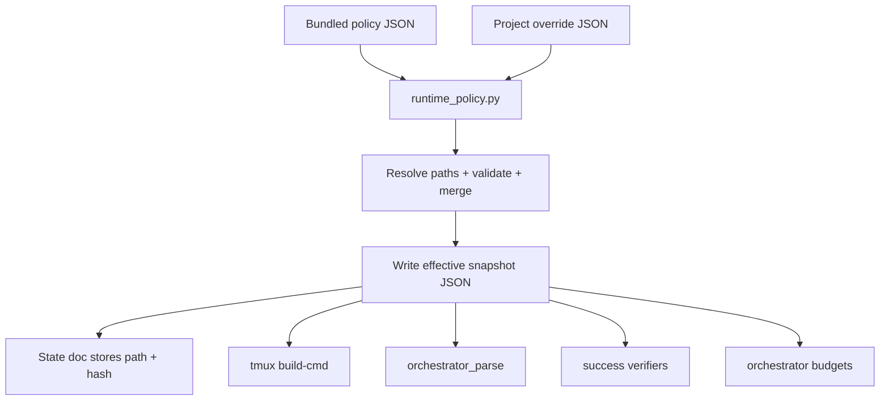

# Policy Model

## Target Shape

Introduce one new concept: the runtime policy.

It has three layers:

1. bundled default policy
2. optional project override policy
3. effective snapshot written at orchestration start

Only the snapshot is allowed to drive an in-flight run.

## File Locations

### Bundled default policy

```text
skills/bmad-story-automator/data/orchestration-policy.json
```

### Bundled prompt templates

```text
skills/bmad-story-automator/data/prompts/
  create.md
  dev.md
  auto.md
  review.md
  retro.md
```

### Bundled parse contracts

```text
skills/bmad-story-automator/data/parse/
  create.json
  dev.json
  auto.json
  review.json
  retro.json
```

### Project override

```text
_bmad/bmm/story-automator.policy.json
```

### Effective snapshot

```text
_bmad-output/story-automator/policy-snapshots/<stamp>-<hash>.json
```

### Review machine contract

```text
skills/bmad-story-automator-review/contract.json
```

## Data Flow



## Core Rules

### Rule 1

Bundled defaults must reproduce current behavior exactly.

### Rule 2

Project overrides can customize values, but cannot register new executable code.

### Rule 3

Resume must use the snapshot from state, never live re-merge.

### Rule 4

Prompt text, parse contracts, and verifier thresholds are data.

### Rule 5

tmux lifecycle, monitor logic, file IO, and verifier execution remain Python.

## Merge Rules

Use deterministic merge semantics:

- maps: deep merge
- arrays: replace
- scalars: override
- unknown top-level keys: reject with validation error

This keeps overrides predictable and makes snapshots stable.

## JSON Schema Shape

High-level example:

```json
{
  "version": 1,
  "snapshot": {
    "relativeDir": "_bmad-output/story-automator/policy-snapshots"
  },
  "runtime": {
    "parser": {
      "provider": "claude",
      "model": "haiku",
      "timeoutSeconds": 120
    },
    "merge": {
      "maps": "deep",
      "arrays": "replace"
    }
  },
  "workflow": {
    "sequence": ["create", "dev", "auto", "review", "retro"],
    "repeat": {
      "review": {
        "maxCycles": 5,
        "successVerifier": "review_completion",
        "onIncomplete": "retry",
        "onExhausted": "escalate"
      }
    },
    "crash": {
      "maxRetries": 2,
      "onExhausted": "escalate"
    }
  },
  "steps": {
    "create": {
      "label": "create-story",
      "assets": {
        "skillName": "bmad-create-story",
        "workflowCandidates": ["workflow.md", "workflow.yaml"],
        "instructionsCandidates": ["discover-inputs.md"],
        "checklistCandidates": ["checklist.md"],
        "templateCandidates": ["template.md"],
        "required": ["skill", "workflow"]
      },
      "prompt": {
        "templateFile": "data/prompts/create.md",
        "interactionMode": "autonomous"
      },
      "parse": {
        "schemaFile": "data/parse/create.json"
      },
      "success": {
        "verifier": "create_story_artifact",
        "config": {
          "glob": "_bmad-output/implementation-artifacts/{story_prefix}-*.md",
          "expectedMatches": 1
        }
      }
    },
    "review": {
      "label": "code-review",
      "assets": {
        "skillName": "bmad-story-automator-review",
        "workflowCandidates": ["workflow.yaml", "workflow.md"],
        "instructionsCandidates": ["instructions.xml"],
        "checklistCandidates": ["checklist.md"],
        "required": ["skill", "workflow"]
      },
      "prompt": {
        "templateFile": "data/prompts/review.md",
        "interactionMode": "autonomous",
        "acceptExtraInstruction": true,
        "defaultExtraInstruction": "auto-fix all issues without prompting"
      },
      "parse": {
        "schemaFile": "data/parse/review.json"
      },
      "success": {
        "verifier": "review_completion",
        "contractFile": ".claude/skills/bmad-story-automator-review/contract.json"
      }
    }
  }
}
```

## Named Verifiers

Initial verifier set should stay small:

- `create_story_artifact`
- `session_exit`
- `review_completion`
- `epic_complete`

No custom verifier registration in settings.

## Prompt Template Rules

Prompt templates should support simple substitution only:

- `{{story_id}}`
- `{{story_prefix}}`
- `{{label}}`
- `{{skill_line}}`
- `{{workflow_line}}`
- `{{instructions_line}}`
- `{{checklist_line}}`
- `{{template_line}}`
- `{{extra_instruction}}`

No loops, no conditions beyond small optional-line helpers in Python.

## Success Contract Rules

The runtime should use settings to decide:

- which verifier to run
- which config to pass it
- which sources to trust first
- which statuses count as done or incomplete

It should not use session output alone as final truth except for explicitly simple verifiers like `session_exit`.

## State Doc Metadata

State frontmatter should store only:

- `policyVersion`
- `policySnapshotFile`
- `policySnapshotHash`
- `legacyPolicy` when needed

The state file should not store the full merged policy blob.

## Why The Snapshot Matters

Without a pinned snapshot, these changes become unsafe:

- skill update
- project override edit
- prompt tweak during an in-flight run
- verifier threshold change after preflight

The snapshot prevents those mutations from changing the behavior of a resumed orchestration.
