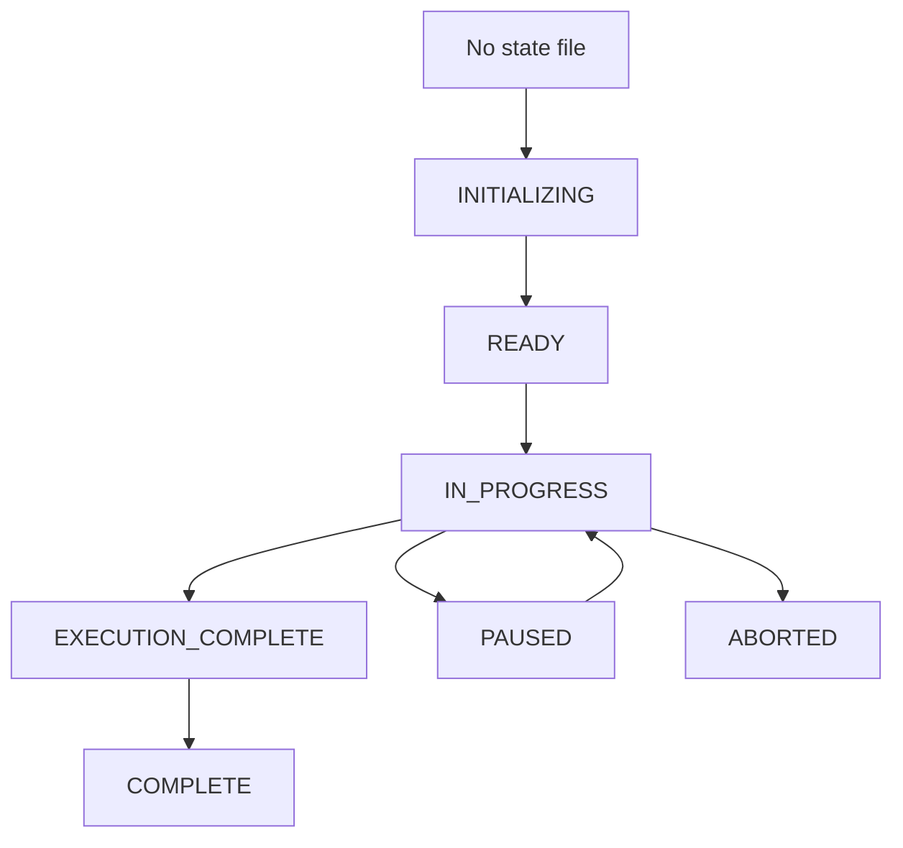
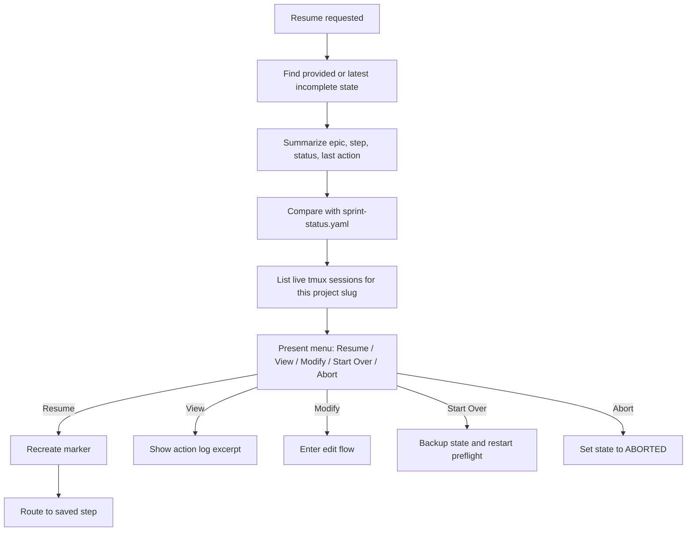
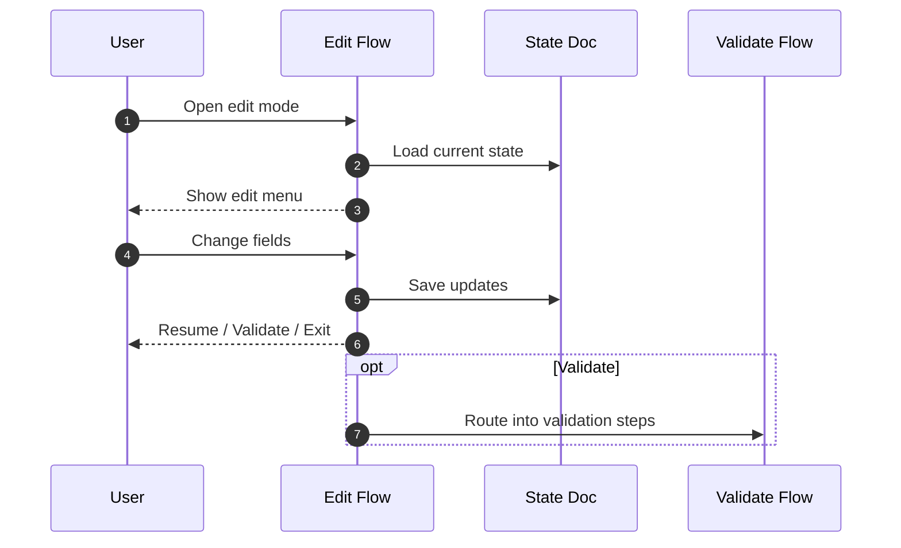

# State And Resume

This doc explains the orchestration state document, the active-run marker, and the resume, validate, and edit flows.

## State Document Anatomy

The state document is generated from `templates/state-document.md` and written as:

```text
_bmad-output/story-automator/orchestration-<epic>-<timestamp>.md
```

It has two parts:

1. frontmatter for machine-readable orchestration state
2. markdown sections for operator-facing progress and logs

### Frontmatter Fields

Important frontmatter fields:

- `epic`
- `epicName`
- `storyRange`
- `status`
- `currentStory`
- `currentStep`
- `stepsCompleted`
- `lastUpdated`
- `aiCommand`
- `overrides`
- `customInstructions`
- `agentsFile`
- `complexityFile`
- `agentConfig`
- `activeSessions`
- `completedSessions`
- `policyVersion`
- `policySnapshotFile`
- `policySnapshotHash`
- `legacyPolicy`

### Body Sections

Important markdown sections:

- `Configuration`
- `Story Progress`
- `Action Log`
- `Session References`
- `Pending Decisions`
- `Learnings & Recommendations`

## State Lifecycle



The state file is updated throughout the run. It is not just a final report.

Allowed status transitions:

| Current | Allowed next values |
|---------|---------------------|
| `INITIALIZING` | `INITIALIZING`, `READY`, `ABORTED` |
| `READY` | `READY`, `IN_PROGRESS`, `PAUSED`, `ABORTED` |
| `IN_PROGRESS` | `IN_PROGRESS`, `PAUSED`, `EXECUTION_COMPLETE`, `COMPLETE`, `ABORTED` |
| `PAUSED` | `PAUSED`, `IN_PROGRESS`, `ABORTED` |
| `EXECUTION_COMPLETE` | `EXECUTION_COMPLETE`, `COMPLETE`, `ABORTED` |
| `COMPLETE` | `COMPLETE` |
| `ABORTED` | `ABORTED` |

`orchestrator-helper state-update --set status=<value>` rejects transitions outside this table and returns structured diagnostics with `currentStatus`, `attemptedStatus`, and `allowedTransitions`.

## Marker File

During active orchestration, Story Automator writes:

```text
<active-runtime-parent>/.story-automator-active
```

Common paths are:

- `.claude/.story-automator-active`
- `.agents/.story-automator-active`
- `.codex/.story-automator-active`

The marker contains:

- current epic
- current story
- remaining story count
- state file path
- heartbeat data
- project slug and pid metadata

Purpose:

- block accidental stop-hook exits while work remains
- make resume logic safer
- distinguish orchestrator children from unrelated top-level sessions

The marker is removed in wrap-up.

## Resume Flow



Resume is step-aware. It does not blindly restart from the beginning.

### Policy Rules On Resume

- new-format state docs must load `policySnapshotFile` plus `policySnapshotHash`
- missing or mismatched snapshots are validation failures, not fallback cases
- old state docs without snapshot metadata resume in legacy mode with bundled defaults
- `state-summary` reports `legacyPolicy: true` for those legacy resumes

### Legacy Env Compatibility

For one release cycle, `MAX_REVIEW_CYCLES` and `MAX_CRASH_RETRIES` still work at orchestration start.

They are resolved once, written into the effective policy snapshot, and ignored on resume after that.

Deprecation path:

1. keep existing env knobs working for fresh starts
2. prefer JSON policy overrides for new setup
3. remove the env path after the compatibility window closes

## Validate Flow

Validation is a first-class mode, not an ad hoc debug routine.

It checks:

- required frontmatter fields
- valid status enums
- field-specific structured diagnostics
- YAML/frontmatter integrity
- session references vs live tmux sessions
- per-story progress consistency
- stalled or impossible progress combinations

`validate-state` keeps the legacy `issues: list[str]` field for compatibility and also returns `structuredIssues: list[object]` plus `issueCount`. New validation flows should prefer `structuredIssues` and fall back to `issues` for older helpers.

The validation flow combines structure, session, and progress checks before reporting a final severity bucket.

## Edit Flow

Edit mode lets an operator change orchestration configuration without hand-editing markdown.

Editable areas:

- status
- story range
- execution overrides
- custom context
- AI command
- project-document paths



## Source Of Truth Rules

Not all state is equal.

- state document = orchestration control state
- tmux sessions = execution-state truth
- story files and sprint status = workflow truth

When these disagree:

- the orchestrator should trust source-of-truth artifacts over stale monitor output
- validation should report the mismatch rather than hiding it
- resume should surface the mismatch before continuing

## Practical Operator Notes

- keep the state file; it is the audit trail for the run
- use validate mode when a run looks suspicious before resuming
- use edit mode instead of raw manual frontmatter edits when possible
- a missing marker does not mean a run is complete; check the state file and tmux sessions together

## Read Next

- [Agents And Monitoring](./agents-and-monitoring.md)
- [Troubleshooting](./troubleshooting.md)
