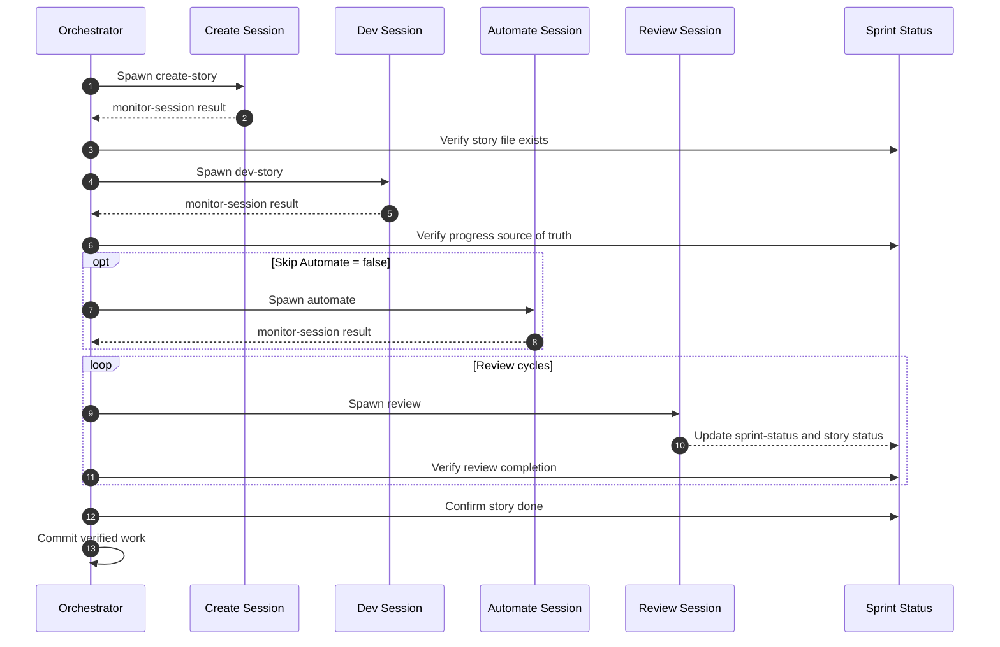
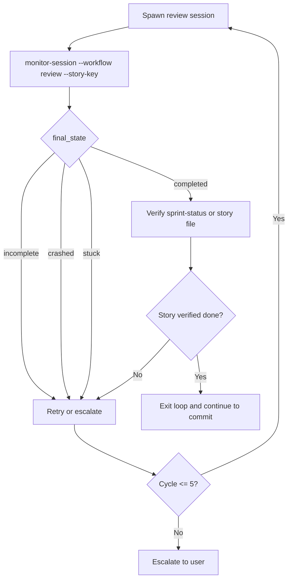
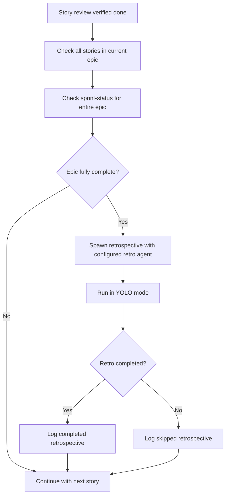

# Story Execution

This doc covers what happens after preflight has finished and the orchestrator enters the execution loop.

## Per-Story Lifecycle

Every story moves through the same high-level phases.

The orchestrator does not blindly trust session completion. It verifies after each step before moving on.

## Step Ordering Rules

The execution loop follows these rules:

- `create` must succeed before `dev`
- `dev` must succeed before `review`
- `auto` is optional and controlled by `skipAutomate`
- `review` can repeat
- `git commit` happens only after review verification passes

The execution-pattern docs explicitly forbid chaining steps in a single shell loop without per-step verification.

## Code Review Loop

The review loop is the most important gate in the system.

What counts as a pass:

- review leaves zero critical issues after fixes
- sprint status shows the story as `done`
- or, if needed, the story file shows `Status: done`

What does not count as a pass:

- the child review session exited
- the output file looks finished but sprint status did not update
- progress text suggests success without verification

## Retry And Fallback

The orchestrator supports deterministic retries and agent fallback.

- retries are bounded
- fallback agents come from the generated agent plan
- network or transient failures can sleep before retry
- escalation happens only after retry budget is exhausted

Review, create, dev, and automate all use the same spawn/monitor pattern, but review adds verification before it can declare success.

## Epic Completion And Retrospective

Retrospective is triggered inside the execution loop, not only at final wrap-up.

Retrospective rules:

- uses configured retro agent
- fully automated
- non-blocking
- failure is logged but does not stop the run

## Execution Complete

After the last story:

- orchestration status changes to `EXECUTION_COMPLETE`
- the system moves to wrap-up
- wrap-up writes summary, learnings, recommendations, and removes the active marker

## Practical Operator Notes

- review verification is the real gate
- retrospective runs per completed epic, not just once at the end
- if monitoring fails, the orchestrator is supposed to re-check tmux and workflow truth directly
- `maxParallel > 1` is allowed only when story dependencies permit it

## Read Next

- [Review Workflow](./review-workflow.md)
- [Agents And Monitoring](./agents-and-monitoring.md)
- [Troubleshooting](./troubleshooting.md)
