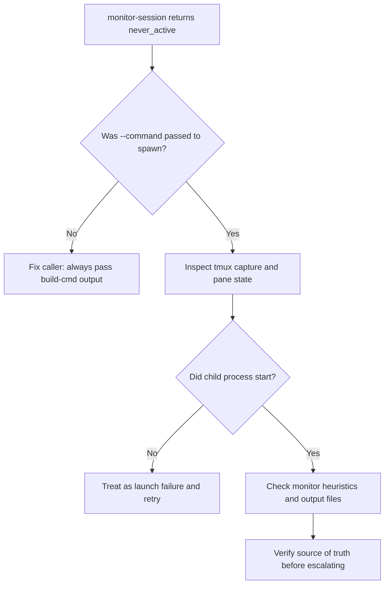
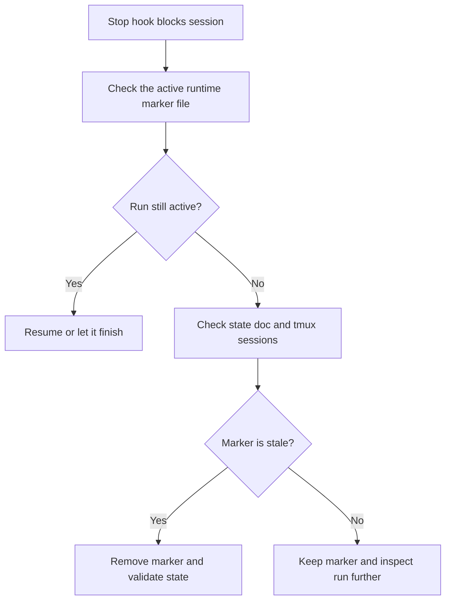

# Troubleshooting

This doc collects the failure modes that matter most during real runs.

## `never_active`

`never_active` means the monitor concluded that a child session never really started doing work.

Common causes:

- `tmux-wrapper spawn` was called without `--command`
- the child process crashed before emitting useful output
- tmux exists but the session never advanced beyond an idle shell

Decision path:



## Stop Hook Blocks A Normal Session

If a normal top-level session complains that Story Automator is active:

- check the active runtime marker path
- confirm whether orchestration is really still running
- if the run finished but cleanup did not happen, remove or reconcile the marker carefully



## Review Session Exited But Story Is Not Done

This usually means:

- the review child exited
- sprint status was not updated
- story status fallback did not report `done`

Response:

- use `monitor-session --workflow review --story-key ...`
- run `orchestrator-helper verify-code-review <story>`
- inspect `sprint-status.yaml`
- inspect the story file status

## Optional Automate Skill Missing

Install warnings about `bmad-qa-generate-e2e-tests` are non-fatal.

Use:

- `Skip Automate = true`

Do not treat this as a runtime crash unless the run still tries to execute automate despite missing support.

## BMAD Method Install Channel Reports

For `automator` installs through BMAD Method, collect the exact command, requested
tag or branch, target tool, full installer output, and `_bmad/_config/manifest.yaml`.
Include `_bmad/install-manifest.csv` only if that file exists in the target
project. Record whether the install used plain `--modules`, a stable-channel
option such as `--all-stable` or `--channel stable`, `--pin`, or
`--custom-source`.

Stable Codex install path:

```bash
npx bmad-method install --modules automator --pin automator=v1.15.0 --tools codex --yes
```

Pre-Codex fallback path:

```bash
npx bmad-method install --modules automator --pin automator=v1.14.2 --tools claude-code --yes
```

`v1.14.2` predates Codex support, so this fallback returns testers to the
Claude Code stable path.

If a future preview later breaks, do not move the published tag. Fix forward
with the next preview tag, then testers reinstall with:

```bash
npx bmad-method install --modules automator --pin automator=v1.15.0-next.2 --tools codex --yes
```

Avoid plain `--modules automator` for stable rollback while the official registry
keeps `automator` on `default_channel: next`; that path resolves to `main` HEAD.
`--next automator` also means `main` HEAD, not the preview branch, pull request, npm
dist-tag, or prerelease git tag.

For custom-source installs, do not trust exit code alone. Confirm the
custom-source cache HEAD and installed Codex runtime files such as
`runtime_layout.py` and `stop_hooks.py`. If the custom source uses official
module code `automator`, BMAD-METHOD 6.6.0 can still record official registry
`next`/`main` metadata in `_bmad/_config/manifest.yaml`; do not treat that
manifest field as proof that the branch content failed to install.

## Sprint Status Drift

If the state doc and `sprint-status.yaml` disagree:

- trust workflow truth first
- use validate mode
- use resume mode only after the mismatch is understood
- do not manually declare stories complete based only on action-log text

## Stale tmux Sessions

If state references sessions that no longer exist:

- validate the state
- list project-scoped sessions
- clean stale refs through the helper or by resuming/editing and re-saving state

If tmux sessions exist but are not tracked:

- treat them as suspicious
- inspect their pane output before killing them

## Long Command Issues

Long prompts are written to `/tmp/sa-cmd-<session>.sh`.

If a long command path fails:

- inspect the session capture
- confirm the temp script exists
- confirm the session started with the expected env vars

## Useful Checks

Resolve the installed helper first:

```bash
scripts=""
for root in .agents/skills .claude/skills .codex/skills; do
  candidate="$root/bmad-story-automator/scripts/story-automator"
  if [ -x "$candidate" ]; then
    scripts="$candidate"
    break
  fi
done
[ -n "$scripts" ] || { echo "story-automator not found in supported skill roots" >&2; exit 1; }
```

```bash
"$scripts" tmux-wrapper list --project-only
```

```bash
"$scripts" orchestrator-helper state-list _bmad-output/story-automator
```

```bash
"$scripts" orchestrator-helper verify-code-review 1.2
```

## Read Next

- [Agents And Monitoring](./agents-and-monitoring.md)
- [State And Resume](./state-and-resume.md)
