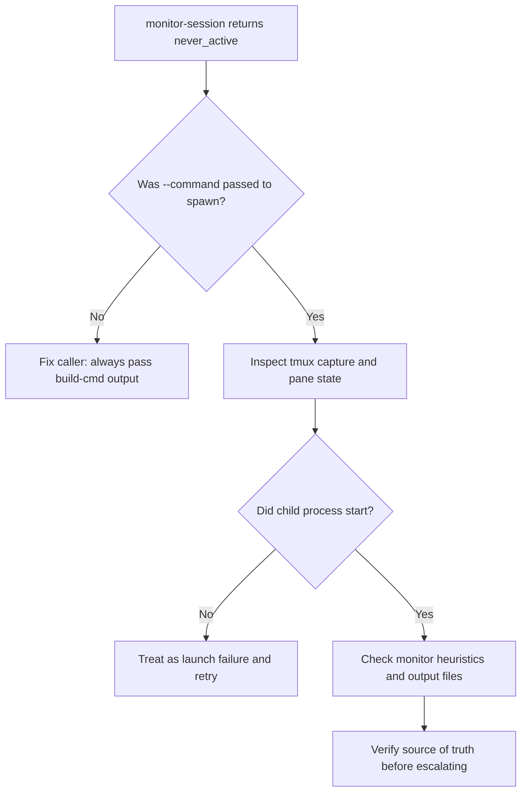
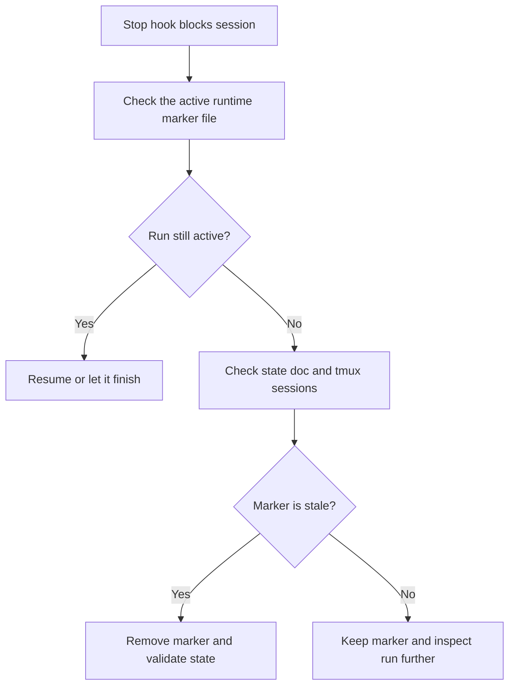

# Troubleshooting

This doc collects the failure modes that matter most during real runs.

## `never_active`

`never_active` means the monitor concluded that a child session never really started doing work.

Common causes:

- `tmux-wrapper spawn` was called without `--command`
- the child process crashed before emitting useful output
- tmux exists but the session never advanced beyond an idle shell

Decision path:



## Stop Hook Blocks A Normal Session

If a normal top-level session complains that Story Automator is active:

- check the active runtime marker path
- confirm whether orchestration is really still running
- if the run finished but cleanup did not happen, remove or reconcile the marker carefully



## Review Session Exited But Story Is Not Done

This usually means:

- the review child exited
- sprint status was not updated
- story status fallback did not report `done`

Response:

- use `monitor-session --workflow review --story-key ...`
- run `orchestrator-helper verify-code-review <story>`
- inspect `sprint-status.yaml`
- inspect the story file status

## Optional Automate Skill Missing

Install warnings about `bmad-qa-generate-e2e-tests` are non-fatal.

Use:

- `Skip Automate = true`

Do not treat this as a runtime crash unless the run still tries to execute automate despite missing support.

## Sprint Status Drift

If the state doc and `sprint-status.yaml` disagree:

- trust workflow truth first
- use validate mode
- use resume mode only after the mismatch is understood
- do not manually declare stories complete based only on action-log text

## Stale tmux Sessions

If state references sessions that no longer exist:

- validate the state
- list project-scoped sessions
- clean stale refs through the helper or by resuming/editing and re-saving state

If tmux sessions exist but are not tracked:

- treat them as suspicious
- inspect their pane output before killing them

## Long Command Issues

Long prompts are written to `/tmp/sa-cmd-<session>.sh`.

If a long command path fails:

- inspect the session capture
- confirm the temp script exists
- confirm the session started with the expected env vars

## Useful Checks

```bash
<installed-skill-root>/bmad-story-automator/scripts/story-automator tmux-wrapper list --project-only
```

```bash
<installed-skill-root>/bmad-story-automator/scripts/story-automator orchestrator-helper state-list _bmad-output/story-automator
```

```bash
<installed-skill-root>/bmad-story-automator/scripts/story-automator orchestrator-helper verify-code-review 1.2
```

## Read Next

- [Agents And Monitoring](./agents-and-monitoring.md)
- [State And Resume](./state-and-resume.md)
